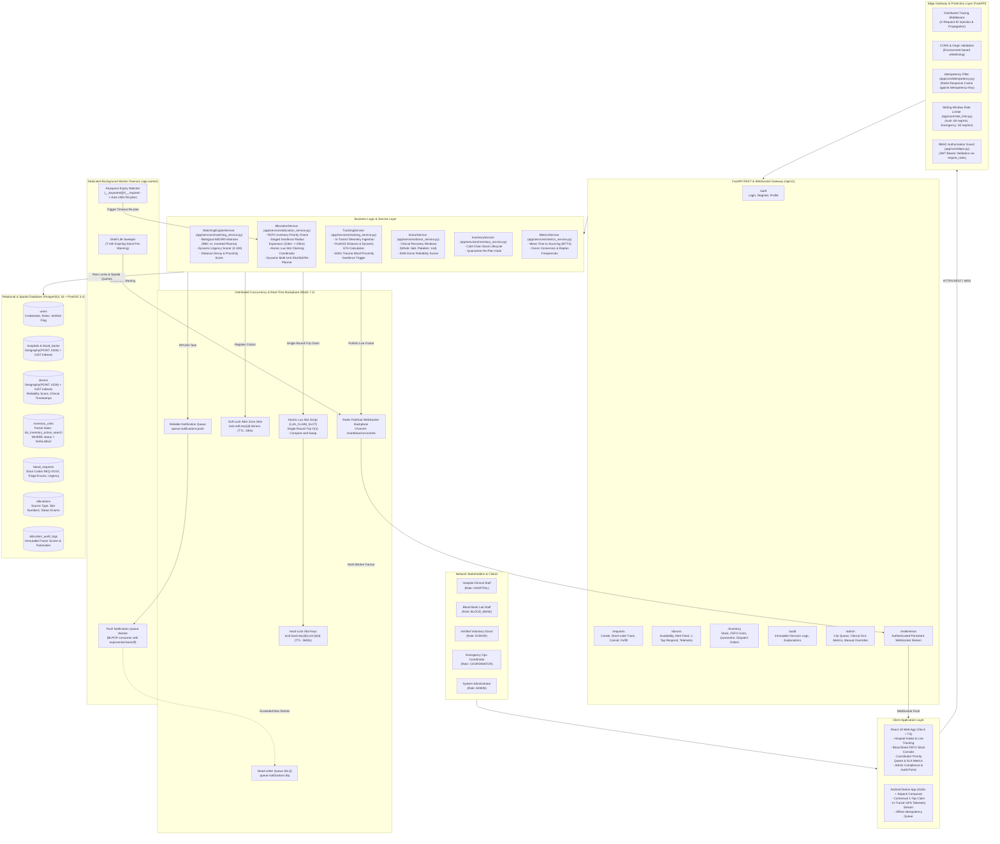
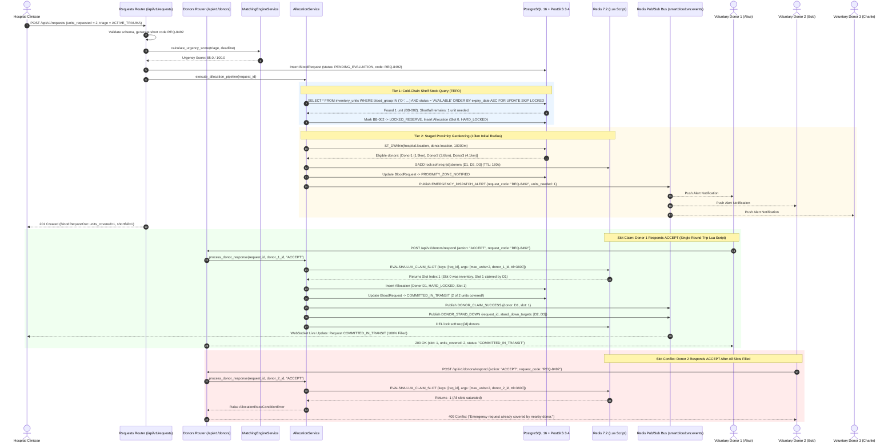
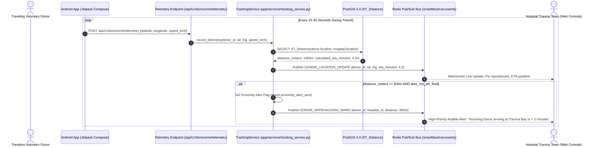
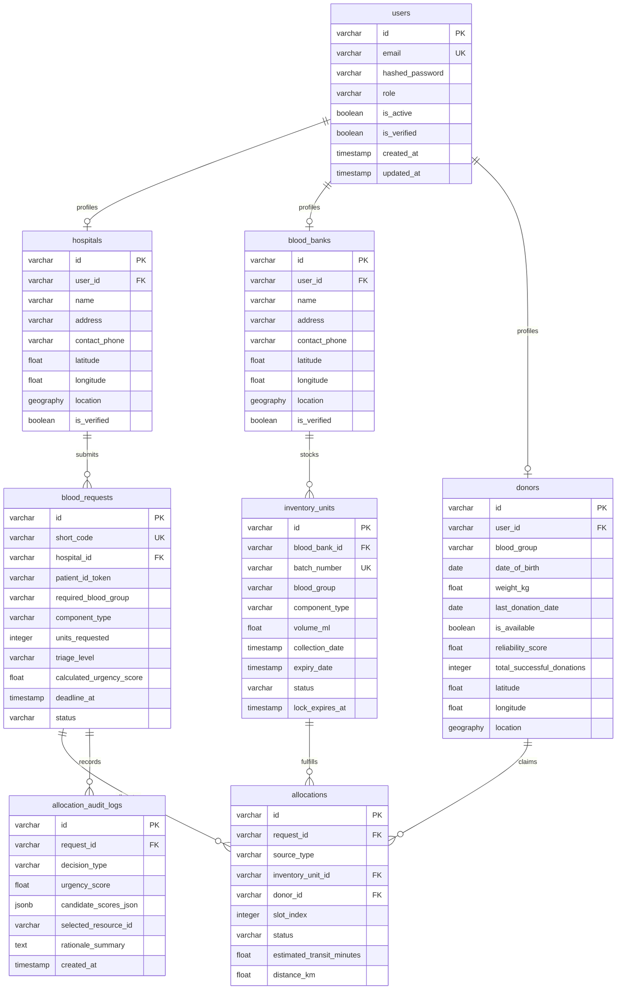
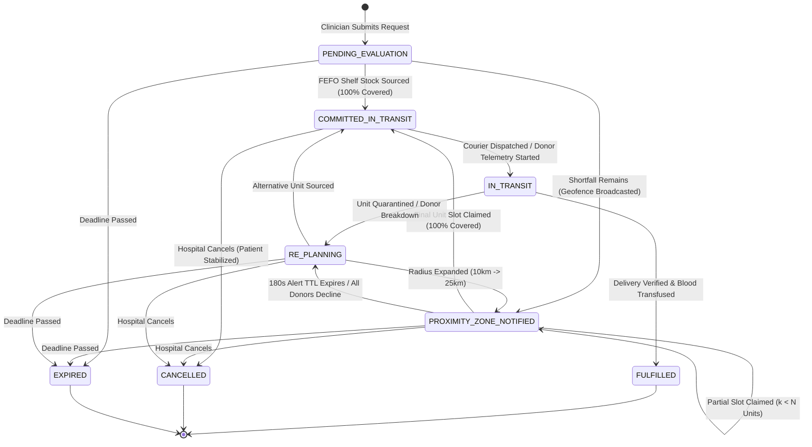
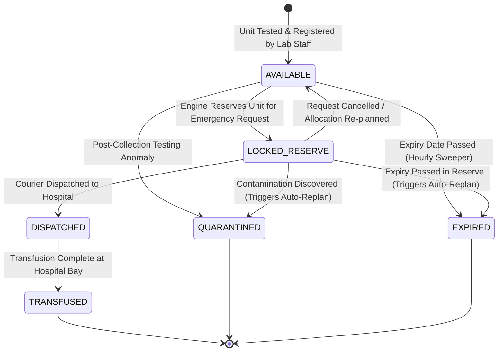

# System Architecture
# SmartBlood (Yarin) — Smart Blood & Emergency Donor Network

**Version:** 2.0 (Enterprise Resilient Architecture)  
**Stack Reference:** [Stack.md](Stack.md)  
**PRD Reference:** [PRD.md](PRD.md)  
**Operational Status:** [STATUS.md](STATUS.md)  
**Workflow Specification:** [Workflow.md](Workflow.md)  

---

## 1. Executive Summary & Architectural Tenets

SmartBlood (Yarin) is an intelligent, real-time emergency blood allocation and voluntary donor dispatch platform. It bridges hospitals, blood banks, and voluntary donors with geospatial proximity matching, automated biological compatibility checks, distributed concurrency locks, background task workers, live WebSocket updates, and predictive in-transit GPS telemetry.

The system is designed around six foundational architectural tenets:

1. **Sub-Millisecond Concurrency & Atomic Safety**: During emergency mass-casualty events, multiple voluntary donors in the proximity zone may respond simultaneously. Multi-unit allocation must be atomic, preventing race conditions or double-allocations using single-round-trip Redis Lua scripts.
2. **Cold-Chain Shelf Stock Priority**: To conserve voluntary donor stamina and maximize resource efficiency, the engine always queries available, verified blood bank inventory using First-Expired, First-Out (FEFO) ordering with row-level locks (`SELECT ... FOR UPDATE SKIP LOCKED`) before initiating live-donor geofencing.
3. **Two-Tier Background Task Offloading**: High-latency operations (push notification queues, Dead-Letter Queues, Redis keyspace expiration watchers, and scheduled shelf-life sweeps) are cleanly separated into a dedicated out-of-process worker daemon (`app.worker`), keeping synchronous HTTP API response times below 20ms.
4. **Self-Healing & Event-Driven Re-Planning**: When real-world resources fail (e.g., blood units quarantined, donor transport vehicle failure, or 180s geofence timeout), the system automatically releases locks, recalculates shortfalls, and executes dynamic re-planning.
5. **Deterministic Explainability & Clinical Auditability**: The allocation engine uses deterministic multi-factor weighted scoring—never opaque black-box AI/ML models. Every decision persists an immutable audit log detailing biological factors, proximity metrics, FEFO batch selection, and human-readable rationales.
6. **Mobile Resilience & Edge Protection**: Spotty mobile data connections from traveling donors are shielded by `Idempotency-Key` response caching, sliding-window rate limiting, and end-to-end correlation tracing (`X-Request-ID`).

---

## 2. Master System Architecture Flowchart

The following diagram illustrates the complete end-to-end data flow, system boundaries, edge gateways, application services, concurrency managers, worker daemons, and storage tiers:



---

## 3. Core Processing Lifecycles & Sequence Diagrams

### 3.1 Multi-Unit Emergency Allocation & Atomic Slot Claiming

When a hospital clinician requests multiple units of blood, the allocation engine first claims available inventory via row-level locks (`SELECT ... FOR UPDATE SKIP LOCKED`). If a shortfall remains, it initiates staged proximity geofencing. Responding voluntary donors claim individual unit slots using an atomic Lua script directly in Redis.



---

### 3.2 Real-Time In-Transit Donor Telemetry & Ward Geofencing

Once an allocation transitions to `COMMITTED_IN_TRANSIT`, traveling voluntary donors stream live GPS coordinates from the mobile application. The backend calculates real-time distance and estimated time of arrival (ETA), automatically firing a high-priority trauma alert when the donor enters within 500m of the hospital trauma center.



---

### 3.3 Dynamic Self-Healing Re-Planning Workflow

If real-world conditions disrupt an active allocation, SmartBlood executes automated self-healing re-planning:

```mermaid
sequenceDiagram
    autonumber
    actor LabStaff as Blood Bank Staff / System Worker
    participant InvAPI as Inventory Router (/api/v1/inventory)
    participant Worker as Background Worker Daemon (app.worker)
    participant AllocSvc as AllocationService (re-planning)
    participant Redis as Redis 7.2
    participant DB as PostgreSQL 16 + PostGIS
    participant Bus as Redis Pub/Sub Bus
    actor Hospital as Hospital Trauma Staff

    alt Scenario A: Reserved Blood Unit Quarantined by Lab Staff
        LabStaff->>InvAPI: PATCH /api/v1/inventory/units/{id}/status {new_status: "QUARANTINED"}
        InvAPI->>DB: Find active allocations holding this unit
        InvAPI->>Redis: Release unit lock
        InvAPI->>AllocSvc: trigger_replan(request_id, reason="UNIT_QUARANTINED")
    else Scenario B: Donor Alert Zone Times Out (180s Expired)
        Redis-->>Worker: Keyspace Notification: __keyevent@0__:expired -> lock:soft:req:{id}:donors
        Worker->>AllocSvc: handle_allocation_timeout(request_id)
    else Scenario C: Donor Vehicle Breakdown In Transit
        Donor->>DonorAPI: POST /api/v1/donors/requests/{id}/respond {action: "CANCEL_IN_TRANSIT"}
        DonorAPI->>AllocSvc: trigger_replan(request_id, reason="DONOR_CANCELLED")
    end

    Note over AllocSvc,DB: Self-Healing Re-Plan Execution
    AllocSvc->>DB: Mark affected Allocation -> RE_OPTIMIZED / TIMED_OUT / CANCELLED_BY_DONOR
    AllocSvc->>DB: Update BloodRequest status -> RE_PLANNING
    AllocSvc->>Bus: Publish RE_PLANNING_ALERT {request_id, reason}
    Bus-->>Hospital: Real-Time Banner: "Resource unavailable; system re-evaluating alternative"
    
    AllocSvc->>AllocSvc: Calculate exact shortfall (requested - still_covered)
    AllocSvc->>DB: Re-query FEFO inventory for compatible alternatives
    alt Alternative Unit Sourced from Inventory
        AllocSvc->>DB: Lock alternative unit -> LOCKED_RESERVE, Allocation -> HARD_LOCKED
        AllocSvc->>DB: Update BloodRequest -> COMMITTED_IN_TRANSIT
        AllocSvc->>Bus: Publish ALTERNATIVE_FOUND {resource_type: "INVENTORY", eta: 12}
    else Inventory Depleted -> Expand Proximity Geofence (10km -> 25km)
        AllocSvc->>DB: ST_DWithin(hospital.location, donor.location, 25000m)
        AllocSvc->>Redis: SADD lock:soft:req:{id}:donors [Expanded Cohort] (TTL: 180s)
        AllocSvc->>DB: Update BloodRequest -> PROXIMITY_ZONE_NOTIFIED
        AllocSvc->>Bus: Publish EMERGENCY_DISPATCH_ALERT (Expanded Zone)
    end
```

---

## 4. Component Design & Directory Structure

The backend is organized into a clean, layered modular architecture with strict separation of concerns:

```text
backend/app/
├── main.py                  # Application entry point, CORS, lifespan hooks, Redis Pub/Sub listener
├── worker.py                # Standalone Background Worker Daemon (Queues, Keyspace events, Sweepers)
├── init_db.py               # Database migration bootstrapper (alembic upgrade head)
├── seed.py                  # Synthetic demo scenario seeder (Section 14 verification)
├── core/
│   ├── config.py            # Pydantic v2 environment settings with production validation
│   ├── database.py          # SQLAlchemy 2.0 async engine & sessionmaker (expire_on_commit=False)
│   ├── redis.py             # Async Redis client, Lua scripts (LUA_CLAIM_SLOT), lock management
│   ├── security.py          # Password hashing (bcrypt) and JWT encoding/decoding (HS256)
│   ├── deps.py              # RBAC dependency factory require_roles(), session dependencies
│   ├── exceptions.py        # DomainException, AllocationRaceConditionError, DonorIneligibleError
│   ├── idempotency.py       # Redis-backed Idempotency-Key response caching dependency
│   ├── rate_limit.py        # Redis sorted-set sliding-window token limiter
│   └── tracing.py           # Correlation ID tracking (X-Request-ID) middleware
├── models/
│   ├── base.py              # Timestamped declarative base with UTC helpers
│   ├── user.py              # User entity and UserRole enum
│   ├── hospital.py          # Hospital profile with Geography(POINT, 4326)
│   ├── blood_bank.py        # BloodBank profile with Geography(POINT, 4326)
│   ├── donor.py             # Donor profile with Geography(POINT, 4326), reliability score
│   ├── inventory.py         # InventoryUnit, BloodComponentType, UnitStatus
│   ├── request.py           # BloodRequest, TriageLevel, RequestStatus, short code REQ-XXXX
│   ├── allocation.py        # Allocation, AllocationSourceType, AllocationStatus
│   └── audit.py             # AllocationAuditLog (immutable decision records)
├── repositories/
│   ├── base.py              # Generic async CRUD repository
│   ├── donor_repo.py        # PostGIS ST_DWithin query with clinical recovery window filter
│   └── inventory_repo.py    # FEFO query with SELECT ... FOR UPDATE SKIP LOCKED
├── services/
│   ├── matching_service.py  # Biological matrices (RBC/Plasma), urgency formula, proximity decay
│   ├── allocation_service.py# Multi-unit allocation pipeline, Lua slot claims, self-healing re-planner
│   ├── donor_service.py     # Donor eligibility validation, recovery periods, EMA reliability
│   ├── inventory_service.py # Expiry sweeps, inventory quarantine & re-plan triggers
│   ├── tracking_service.py  # In-transit GPS telemetry, PostGIS ETA, 500m ward proximity alert
│   └── metrics_service.py   # Clinical SLA metrics (MTTS, conversion rate, replan frequency)
├── websocket/
│   └── connection_manager.py# Horizontal WebSocket manager backed by Redis Pub/Sub (smartblood:ws:events)
└── api/
    └── v1/
        ├── router.py        # Aggregator mounting all v1 sub-routers
        ├── auth.py          # /auth (login, register, me)
        ├── requests.py      # /requests (create, track, cancel, fulfill)
        ├── donors.py        # /donors (availability, alerts, respond, telemetry)
        ├── inventory.py     # /inventory (stock, units, status, orders, dispatch)
        ├── hospitals.py     # /hospitals (facility directory)
        ├── audit.py         # /audit (logs, per-request explainability)
        └── admin.py         # /admin (overview, metrics, overrides, demo reset)
```

---

## 5. Two-Tier Background Task Architecture

To guarantee sub-millisecond API response times and protect transactional integrity during mass emergency events, SmartBlood establishes a strict two-tier asynchronous architecture:

```
                            ┌──────────────────────────────────────────────┐
                            │                 FastAPI App                  │
                            │  - Input Validation (Pydantic v2)           │
                            │  - Atomic Redis Lock Acquisition (Lua)      │
                            │  - ACID DB Row Updates (SQLAlchemy async)    │
                            │  - HTTP 200 / 201 Response Immediate Return  │
                            └───────┬──────────────────────────────┬───────┘
                                    │                              │
                     FastAPI BackgroundTasks                       │ Redis RPUSH
                     (Same-Process Async Loop)                     │ queue:notifications:push
                                    │                              │
                                    ▼                              ▼
                      ┌───────────────────────────┐  ┌───────────────────────────┐
                      │    Tier 1 Worker Tasks    │  │ Tier 2 Dedicated Worker   │
                      │  - Audit log persistence  │  │   (python -m app.worker)  │
                      │  - Local WebSocket notify │  │  - Push Notification Q    │
                      │  - In-memory event dispatch│  │  - Dead-Letter Queue (DLQ)│
                      │                           │  │  - Keyspace TTL watchdogs │
                      │                           │  │  - T-24h Expiry Sweepers  │
                      └───────────────────────────┘  └───────────────────────────┘
```

### 5.1 Tier 1: In-Process Asynchronous Tasks (`fastapi.BackgroundTasks`)
- **Execution**: Runs inside the Uvicorn event loop immediately after sending the HTTP response.
- **Operations Handled**:
  - Writing detailed candidate scoring objects into `allocation_audit_logs`.
  - Publishing real-time frames to the local WebSocket `ConnectionManager`.
  - Emitting telemetry location pins.

### 5.2 Tier 2: Standalone Worker Daemon (`backend/app/worker.py`)
- **Execution**: Run as an independent operating system process (`python -m app.worker`), independently scalable and resilient to web server restarts.
- **Core Worker Components**:
  1. **Push Notification Consumer (`queue:notifications:push`)**:
     - Uses Redis `BLPOP` to reliably dequeue outgoing dispatch alerts.
     - Implements exponential backoff retries ($2^n$ seconds).
     - Dead-Letter Queue (`queue:notifications:dlq`): Captures permanently failing notifications for administrator inspection without crashing the worker.
  2. **Redis Keyspace Expiration Listener (`__keyevent@0__:expired`)**:
     - Intercepts expiration events for soft-lock keys: `lock:soft:req:{id}:donors`.
     - Automatically calls `AllocationService.handle_allocation_timeout(request_id)` at $t = 180\text{s}$, expanding the proximity search radius to 25 km without human intervention.
  3. **Scheduled Shelf-Life Sweeper (`sweep_expiring_inventory`)**:
     - Periodically queries inventory units expiring within 24 hours (`NOW() + interval '24 hours'`).
     - Issues pre-emptive warnings over WebSockets to blood banks and hospitals to utilize units before expiration.

---

## 6. Mathematical & Biological Engine Specifications

### 6.1 Biological Compatibility Matrices

The platform implements two strictly separated, deterministic compatibility matrices:

#### Red Blood Cells (Whole Blood & PRBC)
Red blood cell transfusions are governed by surface antigens (A, B, RhD):

$$\begin{aligned}
\text{Recipient } O^- &\leftarrow \{O^-\} \quad (\text{Universal Donor for RBCs}) \\
\text{Recipient } O^+ &\leftarrow \{O^-, O^+\} \\
\text{Recipient } A^- &\leftarrow \{O^-, A^-\} \\
\text{Recipient } A^+ &\leftarrow \{O^-, O^+, A^-, A^+\} \\
\text{Recipient } B^- &\leftarrow \{O^-, B^-\} \\
\text{Recipient } B^+ &\leftarrow \{O^-, O^+, B^-, B^+\} \\
\text{Recipient } AB^- &\leftarrow \{O^-, A^-, B^-, AB^-\} \\
\text{Recipient } AB^+ &\leftarrow \{O^-, O^+, A^-, A^+, B^-, B^+, AB^-, AB^+\} \quad (\text{Universal Recipient for RBCs})
\end{aligned}$$

#### Fresh Frozen Plasma (FFP & Cryoprecipitate)
Plasma contains antibodies against absent antigens; thus, plasma compatibility is the **exact inverse** of red blood cells:

$$\begin{aligned}
\text{Recipient } O^- &\leftarrow \{O^-, O^+, A^-, A^+, B^-, B^+, AB^-, AB^+\} \quad (\text{Universal Recipient for Plasma}) \\
\text{Recipient } O^+ &\leftarrow \{O^+, A^+, B^+, AB^+\} \\
\text{Recipient } A^- &\leftarrow \{A^-, A^+, AB^-, AB^+\} \\
\text{Recipient } A^+ &\leftarrow \{A^+, AB^+\} \\
\text{Recipient } B^- &\leftarrow \{B^-, B^+, AB^-, AB^+\} \\
\text{Recipient } B^+ &\leftarrow \{B^+, AB^+\} \\
\text{Recipient } AB^- &\leftarrow \{AB^-, AB^+\} \\
\text{Recipient } AB^+ &\leftarrow \{AB^+\} \quad (\text{Universal Donor for Plasma})
\end{aligned}$$

---

### 6.2 Dynamic Urgency Scoring Formula

Every blood request receives an urgency score $S_{\text{urgency}} \in [0.0, 100.0]$ computed deterministically at creation and re-computed whenever triage or deadline parameters change:

$$S_{\text{urgency}} = \min\left(100.0, \; W_{\text{base}}(\text{triage}) + P_{\text{time}}(t_{\text{remaining}})\right)$$

Where $W_{\text{base}}$ is determined by clinical triage category:

| Triage Level (`TriageLevel`) | Base Weight $W_{\text{base}}$ | Clinical Definition |
| :--- | :--- | :--- |
| `MASSIVE_TRANSFUSION_PROTOCOL` | **95.0** | Catastrophic hemorrhage; immediate survival threat |
| `ACTIVE_TRAUMA` | **80.0** | Severe trauma / surgical hemorrhage requiring urgent blood |
| `SCHEDULED_EMERGENCY_RESERVE` | **50.0** | High-risk emergency surgery standby within hours |
| `ROUTINE_CLINICAL` | **20.0** | Non-critical scheduled elective surgery / chronic anemia |

And $P_{\text{time}}(t_{\text{remaining}})$ applies an exponential urgency penalty as the deadline approaches:

| Time Remaining $t_{\text{remaining}}$ | Time Decay Penalty $P_{\text{time}}$ |
| :--- | :--- |
| $t_{\text{remaining}} \le 15 \text{ minutes}$ | **$+20.0$** |
| $15 \text{m} < t_{\text{remaining}} \le 60 \text{ minutes}$ | **$+10.0$** |
| $60 \text{m} < t_{\text{remaining}} \le 240 \text{ minutes}$ | **$+5.0$** |
| $t_{\text{remaining}} > 240 \text{ minutes}$ | **$+0.0$** |

---

### 6.3 Proximity Decay & Candidate Ranking

Candidate scoring within candidate pools combines physical accessibility and donor reliability:

1. **Inventory Unit Score**:
   $$S_{\text{inventory}} = \text{FEFO\_Rank}(\text{expiry\_date}) \times 0.6 + S_{\text{proximity}}(\text{distance\_km}) \times 0.4$$
   Where $S_{\text{proximity}}(d) = \max\left(0.0, \; 1.0 - \frac{d}{d_{\text{max}}}\right)$.

2. **Donor Candidate Score**:
   $$S_{\text{donor}} = S_{\text{proximity}}(\text{distance\_km}) \times 0.7 + R_{\text{donor}} \times 0.3$$
   Where $R_{\text{donor}} \in [0.0, 1.0]$ is the donor's historical reliability score updated via Exponential Moving Average (EMA) after each dispatch interaction.

---

## 7. Distributed Concurrency & Redis Locking Architecture

### 7.1 Single-Round-Trip Atomic Lua Slot Claiming

To completely eliminate race conditions without requiring slow, deadlock-prone database table locks, SmartBlood uses an atomic Lua script executed inside Redis:

```lua
-- File: backend/app/core/redis.py (LUA_CLAIM_SLOT)
-- KEYS[1]: request canonical ID (e.g., "REQ-8492")
-- ARGV[1]: max_units requested (e.g., 3)
-- ARGV[2]: claiming donor_id (e.g., "d-alice-uuid")
-- ARGV[3]: slot lock TTL in seconds (e.g., 3600)

for i = 0, tonumber(ARGV[1]) - 1 do
    local key = "lock:hard:req:" .. KEYS[1] .. ":unit:" .. i
    if redis.call("SET", key, ARGV[2], "NX", "EX", tonumber(ARGV[3])) then
        return i
    end
end
return -1
```

**Key Concurrency Properties:**
- **Atomicity**: Redis executes Lua scripts on a single thread. No two concurrent donor HTTP requests can evaluate the same slot at the same time.
- **$O(1)$ Network Round-Trip**: The entire iteration through $0 \dots N-1$ keys occurs in Redis memory in $< 1\text{ms}$.
- **Immediate Rejection**: If all slots are claimed, the script returns `-1`, prompting the API to immediately return `HTTP 409 Conflict` and issue a stand-down alert.

### 7.2 Redis Key Schema

| Key Pattern | Redis Type | TTL | Purpose |
| :--- | :--- | :--- | :--- |
| `lock:soft:req:{id}:donors` | `SET` | 180s | Stores candidate donor IDs alerted in proximity zone; enables targeted stand-down notifications. |
| `lock:hard:req:{id}:unit:{slot}` | `STRING` | 3600s | Stores claiming donor ID for a specific unit slot index ($0 \dots N-1$). |
| `idemp:{idempotency_key}` | `STRING` | 86400s (24h) | Caches API response JSON to prevent duplicate execution on network retry. |
| `ratelimit:{ip/user}:{route_tag}` | `ZSET` | Sliding 60s | Stores request timestamps to enforce sliding-window token bucket limits. |
| `smartblood:ws:events` | `CHANNEL` | N/A (Pub/Sub) | Broadcasts live real-time frames across multiple Uvicorn worker instances. |
| `queue:notifications:push` | `LIST` | Persistent | Reliable task queue for outgoing mobile push notifications. |
| `queue:notifications:dlq` | `LIST` | Persistent | Dead-Letter Queue storing payloads that failed after 3 retry attempts. |

---

## 8. Database Architecture & PostGIS Spatial Indexing

### 8.1 Physical Schema Definition (PostgreSQL 16 + PostGIS 3.4)



### 8.2 Spatial & Performance Indexing (Alembic Migration `0003`)

1. **PostGIS GiST Spatial Indexes**:
   ```sql
   CREATE INDEX IF NOT EXISTS idx_donors_location_gist ON donors USING GIST (location);
   CREATE INDEX IF NOT EXISTS idx_blood_banks_location_gist ON blood_banks USING GIST (location);
   CREATE INDEX IF NOT EXISTS idx_hospitals_location_gist ON hospitals USING GIST (location);
   ```
   **Benefit**: Accelerates `ST_DWithin()` proximity geofencing from full-table $O(M)$ scans to sub-5ms logarithmic bounding-box traversals across 500,000+ donors.

2. **Filtered Partial Index on Active Shelf Stock**:
   ```sql
   CREATE INDEX IF NOT EXISTS idx_inventory_active_search 
   ON inventory_units (blood_group, component_type, expiry_date) 
   WHERE status = 'AVAILABLE';
   ```
   **Benefit**: Completely bypasses consumed, expired, or quarantined units, ensuring FEFO matching evaluates only available stock in $< 2\text{ms}$.

---

## 9. State Machine Specifications

### 9.1 Emergency Blood Request State Machine



### 9.2 Inventory Unit State Machine



---

## 10. Security, Privacy & Compliance Architecture

### 10.1 Authentication & Role-Based Access Control (RBAC)
- **Token Format**: Signed JWT using HMAC-SHA256 (`HS256`) containing `sub` (user_id), `role` (`UserRole`), `exp`, and `iat`.
- **RBAC Dependency Factory**: Endpoints declare permitted roles using `require_roles(UserRole.HOSPITAL, UserRole.ADMIN)`. Unauthorized callers receive HTTP 403 Forbidden.
- **Tenant Isolation**: Hospital clinicians can only view and manage requests belonging to their own facility (`hospital_id`). Cross-tenant access attempts are rejected.

### 10.2 Edge Resilience & Protection
- **Sliding-Window Rate Limiting**: Token-bucket counter using Redis sorted sets:
  - Auth routes (`/api/v1/auth/*`): 60 requests per minute per IP.
  - Emergency routes (`/api/v1/donors/respond`, `/api/v1/requests`): 30 requests per minute per authenticated identity.
- **Idempotency Key Verification**:
  - Critical endpoints inspect the `Idempotency-Key` header.
  - Returns cached responses immediately if already executed, shielding the matching engine against mobile retries on unstable cellular connections.
- **Distributed Correlation Tracing**:
  - `X-Request-ID` is extracted or injected into every incoming HTTP request and propagated across application logs, background worker queues, and WebSocket frames.

### 10.3 Privacy & Data Minimization
- **Patient Privacy**: No real patient identifiers are ingested. The system stores an opaque `patient_id_token` supplied by the hospital.
- **PII Masking**: Public donor directories and hospital-facing feeds mask donor personal identifiable information (PII). Donor names, phone numbers, and exact home GPS coordinates are never exposed to hospital portals; only blood group, reliability score, and relative distance estimates are provided.

### 10.4 Static Security Audit Compliance
- **Bandit Security Scan**: Clean audit executed over 5,364 lines of Python backend code with **0 High, 0 Medium** vulnerabilities detected.
- **Secret Hygiene**: Shipped development secrets are strictly blocked when `ENVIRONMENT` is set to `production`.

---

## 11. Failure Handling & Resilience Matrix

| Failure Mode | Detection Mechanism | Automated System Recovery | User-Visible Effect |
| :--- | :--- | :--- | :--- |
| **Simultaneous Donor Tap (Race Condition)** | Redis atomic Lua script returns `-1` | Second caller rejected; hard lock remains intact on first winner | Second donor receives HTTP 409 and polite stand-down notice |
| **Donor Response Timeout (180s)** | Redis Keyspace Expiry daemon (`__keyevent@0__:expired`) | Invokes `handle_allocation_timeout()`; expands geofence from 10km to 25km | Hospital sees radius expansion and new candidate alert count |
| **Reserved Unit Quarantined Mid-Process** | Lab staff sets status `QUARANTINED` | Locks released; allocation marked `RE_OPTIMIZED`; shortfall re-planned | Hospital receives WebSocket alert: alternative unit being sourced |
| **Donor Transport Vehicle Breakdown** | Donor clicks `CANCEL_IN_TRANSIT` | Slot released; allocation set to `CANCELLED_BY_DONOR`; re-plan fired | Hospital notified: replacement donor or inventory being matched |
| **Inventory Depleted with No Nearby Donors** | PostGIS query returns empty candidate pool | Request status set to `RE_PLANNING`; event sweeper watches new stock | Hospital sees "Awaiting resources; priority queue standing by" |
| **Database Transient Disconnect** | `asyncpg` connection pool timeout | Automatic retry with exponential backoff; clean transaction rollback | Temporary HTTP 503; client retries safely via `Idempotency-Key` |
| **Redis Node Failure / Reboot** | Redis connection error exception | FastAPI degrades gracefully; alerts logged; locks re-evaluated from DB | Immediate 503 error on lock routes; auto-reconnects on boot |
| **WebSocket Connection Drop** | Client ping/pong heartbeat timeout | ConnectionManager reaps dead socket; client auto-reconnects with JWT | Transient disconnect banner on UI; full state sync on reconnect |
| **Near-Expiry Inventory Units (T-24h)** | Hourly background sweeper (`app.worker`) | Scans units expiring in $< 24\text{h}$; emits warning to blood bank | Blood bank dashboard highlights unit in amber alert pill |
| **Failed Push Notification Delivery** | Worker queue catches network exception | Retries 3 times; if unsuccessful, routes to Dead-Letter Queue (DLQ) | Notification isolated in DLQ for ops inspection; core flow unharmed |
| **Invalid Request Payload / Malformed Enums** | Pydantic v2 validation layer | Immediate HTTP 422 Unprocessable Entity with error envelope | Client receives field-level correction feedback |
| **Spotty Mobile Cellular Disconnect** | Mobile client re-sends request on reconnect | `Idempotency-Key` filter detects existing key; returns cached response | Donor mobile app sees instant confirmation without double-claim |

---

## 12. Observability & Clinical SLA Metrics

To provide medical directors and emergency coordinators with real-time operational transparency, SmartBlood exposes dedicated clinical SLA metrics via `GET /api/v1/admin/metrics`:

1. **Mean Time to Sourcing (MTTS)**:
   $$\text{MTTS} = \frac{1}{|R_{\text{sourced}}|} \sum_{r \in R_{\text{sourced}}} (t_{\text{committed}} - t_{\text{created}})$$
   Calculates the average elapsed time (in minutes) from emergency request creation until 100% of required units are secured.

2. **Donor Conversion Rate**:
   $$\text{Conversion Rate} = \frac{\text{Total Accepted Claims}}{\text{Total Proximity Alerts Dispatched}} \times 100\%$$
   Measures the percentage of alerted voluntary donors who respond affirmatively and secure a slot.

3. **Re-Plan Frequency**:
   Tracks the ratio of requests experiencing self-healing re-planning cycles due to resource dropouts or laboratory quarantines.

4. **Health Check Probes**:
   - `GET /health` & `GET /api/v1/health`: Returns service health, uptime, and database/cache connectivity states for container orchestrator readiness probes.
