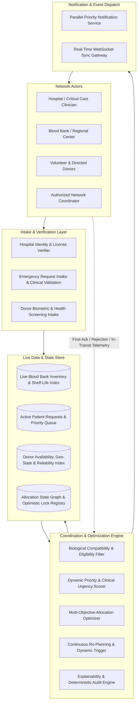
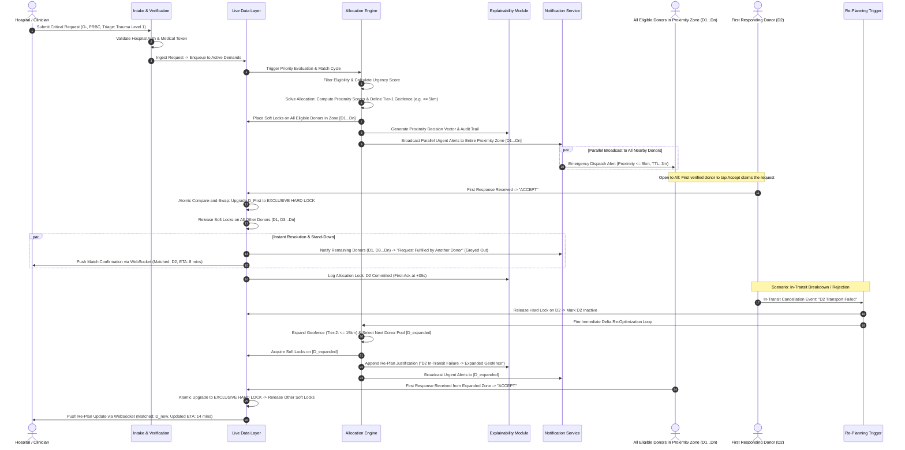

# Software Architecture Document: PS-1 Smart Blood & Emergency Donor Network

## 1. System Design

### 1.1 Problem Framing
Blood and emergency donor management is inherently a multi-constraint, time-critical dynamic resource-allocation problem—not a static donor directory, nearest-neighbor geolocation query, or First-Come-First-Served (FCFS) dispatch tool. The network operates under extreme uncertainty: blood units expire across variable shelf-lives, emergency clinical demands fluctuate non-linearly with physiological triage status, donor response rates degrade with transit latency and attrition, and cross-matching rules enforce strict biological compatibility constraints. Treating this domain as a sequential polling mechanism or simple search query leads to fatal clinical delays: placing an exclusive lock on a single donor and waiting minutes for an acknowledgment creates dead time where patient condition rapidly deteriorates. This platform models supply and demand as a centralized, continuous optimization graph that dynamically computes utility, orchestrates reserve inventory versus live donor mobilizations, employs parallel optimistic candidate ring-fencing with first-to-confirm hard locks, guarantees end-to-end clinical verification, and autonomously re-optimizes allocations when real-world execution deviates from the planned state.

---

### 1.2 High-Level Architecture
The system operates as an event-driven closed loop where clinical inputs continuously re-weight optimization parameters, and operational events trigger automated state adjustments.

* **Actors**: Hospitals/Clinicians submit demand with verified clinical parameters; Blood Banks maintain verified cold-chain stocks; Donors receive targeted alerts and update their transit/readiness status; Coordinators supervise override-level interventions.
* **Intake & Verification**: Intercepts, sanitizes, and verifies all actors and requests against clinical and institutional credentials prior to state entry.
* **Coordination Engine**: Consists of strict biological filtering, dynamic urgency weighting, multi-objective inventory/donor allocation, automated re-planning on operational failure, and mathematical audit trail generation.
* **Live Data Layer**: High-speed, transactional state machine holding optimistic candidate cohort soft-locks, atomic hard-lock transitions, real-time geographic positions, dynamic unit expirations, and active patient queues.
* **Notification Layer**: Low-latency multi-channel dispatch targeting verified matching candidate cohorts simultaneously with rapid first-ack resolution.
* **Feedback & Re-Planning Loop**: Continuous telemetry ingest (e.g., donor cancellations, transit delays, worsening triage levels) that triggers immediate delta re-optimizations.

---

### 1.3 Core System Components

* **Verification & Request Intake**: Validates clinical authenticity, hospital accreditation, patient identification, required blood product components (whole blood, packed RBCs, platelets, plasma), and urgency parameters before admitting requests into the state machine.
* **Compatibility & Eligibility Filter**: Enforces hard medical constraints, including ABO/Rh(D) cross-match rules, rare antibody flags, component-specific viability rules, donor minimum donation intervals (56 days for whole blood, 14 days for platelets), and age/weight/medication exclusion criteria.
* **Priority & Urgency Scoring**: Computes real-time dynamic urgency scores ($S_{urgency} \in [0, 100]$) based on clinical triage status (e.g., Massive Transfusion Protocol, scheduled surgical reserve, active trauma), time-to-treatment deadline, condition decay rate, and local supply scarcity.
* **Allocation/Matching Engine (Core Optimizer)**: Solves a multi-objective optimization problem that balances clinical urgency, real-time proximity/travel-time scores, unit shelf-life (prioritizing older stock before expiry), and donor commitment reliability. When routing to live donors, it dynamically computes a proximity isochrone/geofence and broadcasts simultaneously to **all eligible donors within the proximity boundary** ($D_1, D_2, \dots, D_n$).
* **Continuous Re-Planning/Re-Optimization Trigger**: Event-driven watchdog that listens for state invalidations (geofence timeout with zero responses, in-transit donor cancellation, transit delay exceeding safety thresholds, inventory lock timeouts) and immediately triggers progressive geofence expansion (e.g., widening search radius from 5 km $\rightarrow$ 15 km) and candidate re-dispatch.
* **Explainability & Audit Module**: Generates human-readable, deterministic audit trails for every matching decision, detailing constraint satisfaction, score weights, proximity perimeter calculations, and fallback triggers for clinical accountability.
* **Live Data Layer (Inventory, Requests, Donor Status)**: High-concurrency, transactional data store managing optimistic inventory locks, proximity-zone soft-lock leases, atomic hard-lock upgrades upon first response, donor geo-availability states, and patient queue states.
* **Notification/Communication Service**: Orchestrates parallel multi-candidate dispatch to all nearby donors in the proximity zone, managing fast first-to-confirm resolution, automated cohort dismissal upon fulfillment, and fallback escalation ladders.
* **Real-Time Event/Update Layer**: Low-latency WebSocket/SSE pub-sub bus that pushes state transitions, lock upgrades/releases, allocation updates, and telemetry diffs to connected client sessions.

---

### 1.4 Data Flow Narrative: Lifecycle of a Request (Proximity-Based Geofence Broadcast & First-Ack Hard Lock)

1. **Request Intake & Verification**: A clinician at a certified hospital submits an emergency blood request specifying component type, units required, target patient ABO/Rh profile, and clinical urgency indicator (e.g., Trauma Level 1). The Intake module verifies the clinician's credentials.
2. **Eligibility Filtering & Urgency Scoring**: The request enters the Priority Queue. The compatibility filter checks all available inventory and donor pools. The Urgency Scorer evaluates patient decay rates and computes a composite urgency index.
3. **Proximity-Based Geofence & Soft-Locking**: Because local blood bank inventory has no compatible unreserved stock, the optimizer evaluates geographic coordinates, road network travel times, and traffic conditions. It defines a **Tier-1 Proximity Geofence** (e.g., all verified donors within 5 km / 15 minutes travel time) and applies non-exclusive **optimistic soft locks** across all eligible donors in that zone ($D_1, D_2, \dots, D_n$) rather than arbitrarily capping to a fixed small number.
4. **Parallel Proximity Broadcast**: The Notification Service broadcasts the emergency alert to **all eligible donors within the proximity radius simultaneously** with a short response TTL (e.g., 3 minutes). The request is live and open to all nearby candidates in parallel.
5. **First-Ack Atomic Hard Lock & Greying Out**: As soon as the *first* nearby donor (e.g., D2) taps **ACCEPT**:
   - The backend executes an atomic compare-and-swap upgrading D2 to an **Exclusive Hard Lock** (`COMMITTED_ALLOCATION`).
   - The soft locks on all other nearby donors ($D_1, D_3, \dots, D_n$) are instantly released.
   - The system immediately pushes an event to everyone else, **greying out the action** with the message *"Request already fulfilled by another nearby donor"*.
   - The hospital tracking view receives a live confirmation and transit telemetry stream via WebSocket.
6. **In-Transit Attrition or Zone Timeout**: If the committed donor encounters a breakdown, or if no donor in the Tier-1 radius responds within the 3-minute TTL, the Continuous Re-Planning Trigger immediately fires.
7. **Progressive Geofence Expansion**: The engine automatically widens the proximity perimeter to Tier-2 (e.g., 15 km / 30 minutes drive-time), identifies all additional verified donors in the expanded radius, and broadcasts in parallel until a first-accept hard lock is secured.

---

### 1.5 Key Design Principles

* **Distance & Proximity-Based Dynamic Geofencing**: Emergency dispatches are determined by real-world transit time, road networks, and proximity scoring. Alerts are broadcast to all eligible donors within the calculated proximity zone simultaneously rather than restricted to arbitrary fixed candidate counts.
* **First-Ack Hard Lock with Automatic Stand-Down**: The request is open to the entire proximity zone; the first verified donor to accept claims the exclusive allocation, while the backend atomically dismisses and greys out the notification for all other donors.
* **Progressive Geofence Escalation & Event-Driven Re-Optimization**: If a proximity tier times out with zero responses or an in-transit donor cancels, the system automatically expands the geographic search perimeter and re-optimizes without manual coordinator delay.
* **Priority-Queue & Multi-Factor Scoring Model**: Allocation is governed by objective utility functions balancing clinical criticality, biological compatibility, geographic transit latency, resource shelf-life, and donor fulfillment probabilities, eliminating first-come-first-served biases.
* **Explainability-by-Default**: Every algorithmic decision, candidate cohort ranking, hard-lock transition, and re-planning step produces an immutable, human-interpretable rationale accessible to clinical coordinators and system auditors.
* **Verification-Before-Trust**: No actor, inventory unit, or request enters the active matching graph without cryptographic identity verification, clinical validation, and compatibility checks.

---

## 2. Backend Architecture

### 2.1 Backend Modules & Responsibilities

| Module | Core Responsibility |
| :--- | :--- |
| **Auth & Verification (`auth_verification`)** | Validates hospital licenses, medical staff credentials, donor identities, and issues role-based access tokens. |
| **Requests Management (`requests_mgr`)** | Manages clinical blood request schemas, lifecycle states, medical urgency flags, and request cancellation/fulfillment. |
| **Inventory & Blood Bank (`inventory_mgr`)** | Tracks verified on-shelf blood component units, batch numbers, storage conditions, and expiry dates with optimistic concurrency locks. |
| **Donor Management (`donor_mgr`)** | Maintains donor biological profiles, donation interval eligibility, real-time geo-availability, and reliability scores. |
| **Allocation & Optimization Engine (`allocation_engine`)** | Core mathematical solver executing compatibility filtering, priority scoring, multi-criteria allocation, and candidate cohort ranking. |
| **Continuous Re-Planning Trigger (`replan_trigger`)** | Observes operational failures, donor dropouts, cohort timeout expirations, and transit telemetry to trigger targeted delta re-optimizations. |
| **Explainability & Audit Module (`audit_explainability`)** | Produces deterministic logs, score breakdowns, cohort selection logs, and decision justifications for every allocation and re-plan. |
| **Notification & Communication (`notification_service`)** | Handles parallel multi-candidate message dispatch, first-ack cohort dismissal, escalation ladders, and delivery tracking. |
| **Real-Time Sync Layer (`realtime_sync`)** | Maintains WebSocket/SSE connections, broadcasting live queue changes, lock transitions, match events, and tracking telemetry. |
| **Admin & Coordination Control (`admin_coordination`)** | Provides system-wide observability, emergency manual overrides, parameter calibration, and audit review tools. |

---

### 2.2 Route Catalog by Module

#### 2.2.1 Auth & Verification Module (`auth_verification`)

##### User-Facing Routes
* `POST /api/v1/auth/login` — Authenticates users (Hospitals, Blood Banks, Donors, Admins) and returns role-based JWTs; called by all client login screens.
* `POST /api/v1/auth/register` — Registers new donors or medical institutions; called by client registration screens.
* `GET /api/v1/auth/me` — Fetches current authenticated user profile and verification status; called by all client apps on load.

##### Internal / Not Exposed to Client
* `POST /internal/auth/verify-license` — Validates institutional medical license with national registry service; called by `requests_mgr` and intake pipeline.
* `POST /internal/auth/validate-token` — Validates internal microservice tokens across backend boundaries; called by API Gateway/service middleware.

---

#### 2.2.2 Requests Management Module (`requests_mgr`)

##### User-Facing Routes
* `POST /api/v1/requests` — Creates a verified emergency blood request with clinical urgency parameters; called by Hospital Request Intake screen.
* `GET /api/v1/requests/{id}` — Retrieves detailed status and matching progress for a specific request; called by Hospital and Coordinator tracking screens.
* `GET /api/v1/requests` — Lists active and historical requests filtered by hospital/status; called by Hospital and Coordinator dashboard screens.
* `PATCH /api/v1/requests/{id}/cancel` — Cancels an open blood request when clinical need resolves; called by Hospital Request detail screen.

##### Internal / Not Exposed to Client
* `POST /internal/requests/{id}/state-transition` — Updates request lifecycle state (e.g., PENDING $\rightarrow$ MATCHED $\rightarrow$ FULFILLED); called by `allocation_engine`.
* `GET /internal/requests/active-queue` — Returns prioritized active clinical requests requiring allocation; called by `allocation_engine` batch runner.

---

#### 2.2.3 Inventory & Blood Bank Module (`inventory_mgr`)

##### User-Facing Routes
* `GET /api/v1/inventory` — Lists available blood units, component types, and expiry statuses for a blood bank; called by Blood Bank Inventory screen.
* `POST /api/v1/inventory/units` — Registers new verified blood units into active stock; called by Blood Bank Stock Intake screen.
* `PATCH /api/v1/inventory/units/{id}/status` — Updates unit status (e.g., in-testing, quarantine, expired); called by Blood Bank Inventory screen.

##### Internal / Not Exposed to Client
* `POST /internal/inventory/reserve-lock` — Acquires temporary optimistic reservation lock on specific blood units; called by `allocation_engine`.
* `POST /internal/inventory/release-lock` — Releases reservation lock when allocation fails or expires; called by `replan_trigger`.
* `POST /internal/inventory/commit-unit` — Permanently deducts reserved units upon dispatch confirmation; called by `allocation_engine`.

---

#### 2.2.4 Donor Management Module (`donor_mgr`)

##### User-Facing Routes
* `PATCH /api/v1/donors/availability` — Toggles donor active status and updates approximate current location; called by Donor App Status screen.
* `GET /api/v1/donors/requests/active` — Fetches current pending emergency dispatch request assigned to the donor; called by Donor Incoming Request screen.
* `POST /api/v1/donors/requests/{id}/respond` — Accepts or declines an emergency dispatch assignment (race-to-commit); called by Donor Incoming Request screen.

##### Internal / Not Exposed to Client
* `GET /internal/donors/proximity-eligible-pool` — Queries all verified donors within the target proximity perimeter matching ABO/interval constraints; called by `allocation_engine`.
* `POST /internal/donors/zone-soft-locks` — Applies optimistic non-exclusive soft locks across all eligible donors in the proximity zone; called by `allocation_engine`.
* `POST /internal/donors/{id}/upgrade-hard-lock` — Atomically upgrades first responding donor to exclusive hard lock and frees remaining zone donors; called by `donor_mgr` on respond.
* `POST /internal/donors/release-zone-locks` — Releases all soft locks on remaining zone donors upon fulfillment or timeout; called by `donor_mgr`.
* `PATCH /internal/donors/{id}/reliability-score` — Updates donor reliability weighting after accept/decline/timeout events; called by `audit_explainability`.

---

#### 2.2.5 Allocation & Optimization Engine (`allocation_engine`)

##### User-Facing Routes
*(None — The allocation engine is an autonomous backend optimization system with no direct user triggers.)*

##### Internal / Not Exposed to Client
* `POST /internal/engine/evaluate` — Executes complete optimization run for a given request or active batch; called by `requests_mgr` upon request intake.
* `POST /internal/engine/allocate-proximity-zone` — Calculates travel-time isochrones, identifies proximity perimeter donors, and triggers zone broadcast; called by `allocation_engine` orchestrator.
* `GET /internal/engine/queue` — Inspects the internal ranked priority queue of pending allocations; called by system watchdog.

---

#### 2.2.6 Continuous Re-Planning Trigger (`replan_trigger`)

##### User-Facing Routes
*(None — Re-planning triggers execute strictly on internal telemetry and event signals.)*

##### Internal / Not Exposed to Client
* `POST /internal/replan/trigger` — Ingests cancellation, transit failure, or zone timeout events and triggers geofence expansion; called by `notification_service` & `donor_mgr`.
* `POST /internal/replan/evaluate-timeouts` — Scans active proximity zone leases and triggers radius expansion if zero responses occur within TTL; called by periodic internal cron worker.

---

#### 2.2.7 Explainability & Audit Module (`audit_explainability`)

##### User-Facing Routes
* `GET /api/v1/audit/requests/{id}/explanation` — Returns human-readable matching explanation and score breakdown; called by Hospital and Coordinator Explanation view.
* `GET /api/v1/audit/logs` — Retrieves immutable system-wide allocation decision logs; called by Admin Audit Console.

##### Internal / Not Exposed to Client
* `POST /internal/audit/record-decision` — Persists mathematical weights, constraint matrices, and proximity zone rationale for an allocation; called by `allocation_engine`.
* `POST /internal/audit/record-replan` — Logs re-planning rationale and geofence expansion cause; called by `replan_trigger`.

---

#### 2.2.8 Notification & Communication Service (`notification_service`)

##### User-Facing Routes
*(None — Message transmission is pushed directly via outbound network providers and websockets.)*

##### Internal / Not Exposed to Client
* `POST /internal/notifications/broadcast-proximity-zone` — Triggers parallel high-priority push/SMS alerts to all eligible donors in the proximity perimeter; called by `allocation_engine`.
* `POST /internal/notifications/dismiss-zone` — Sends stand-down notifications to remaining nearby donors once first donor confirms; called by `donor_mgr`.
* `POST /internal/notifications/broadcast-update` — Dispatches event payloads to message brokers for client consumption; called by all core modules.

---

#### 2.2.9 Real-Time Sync Layer (`realtime_sync`)

##### User-Facing Routes
* `GET /api/v1/realtime/ws` — WebSocket upgrade endpoint establishing live bidirectional event connection; called by all active frontend clients.

##### Internal / Not Exposed to Client
* `POST /internal/realtime/publish` — Ingests state diff events and broadcasts to relevant channel subscribers; called by backend services.

---

#### 2.2.10 Admin & Coordination Control Module (`admin_coordination`)

##### User-Facing Routes
* `GET /api/v1/admin/overview` — Fetches global network metrics, active allocations, and bottleneck alerts; called by Coordinator Dashboard.
* `POST /api/v1/admin/allocations/{id}/override` — Manually overrides or re-routes an algorithmic match under exceptional conditions; called by Coordinator Override screen.

##### Internal / Not Exposed to Client
* `POST /internal/admin/recalibrate-weights` — Updates urgency and scoring coefficient weights at runtime; called by system administrator scripts.

---

## 3. Frontend Architecture

### 3.1 Overview & Guiding Principle
The frontend interface is strictly functional, minimal, and reactive. Its sole architectural objective is to demonstrate the end-to-end cycle: **Request Intake $\rightarrow$ Parallel Cohort Dispatch $\rightarrow$ First-Ack Hard Lock $\rightarrow$ Live Explanation $\rightarrow$ In-Transit Attrition $\rightarrow$ Automated Delta Re-Plan**. There are no extraneous profile editors, cosmetic settings, or non-essential visual dashboards. All views use plain, high-clarity forms and live-updating data lists connected via WebSocket to demonstrate engine state transitions in real time.

---

### 3.2 Role-Based Screen Specifications

#### 3.2.1 Patient / Hospital Role

##### 1. Emergency Request Intake Screen
* **Purpose**: Allows authorized clinical staff to formulate and submit time-critical blood requests.
* **Core Features & Actions**:
  * Input patient ABO/Rh(D) blood group, component type (Whole Blood, PRBC, Platelets, FFP), and required unit count.
  * Select clinical urgency level (Massive Transfusion Protocol, Immediate Trauma, Scheduled Emergency Reserve) and deadline timestamp.
  * Submit request and immediately receive verified tracking token.
* **Invoked User-Facing Routes**:
  * `POST /api/v1/requests`

##### 2. Live Request Tracking & Allocation View
* **Purpose**: Displays real-time allocation status, candidate cohort dispatch stage, first-ack committed donor, transit state, and re-planning alerts.
* **Core Features & Actions**:
  * Live status pill showing lifecycle state (`PENDING_EVALUATION`, `COHORT_NOTIFIED`, `COMMITTED_IN_TRANSIT`, `RE_PLANNING`, `FULFILLED`).
  * Real-time ETA, matched blood bank/donor identifier, and transit tracker updated via WebSocket.
  * Expandable "Decision Rationale" panel showing why the candidate cohort and committed resource were chosen.
  * Emergency cancellation button to abort request if patient condition stabilizes.
* **Invoked User-Facing Routes**:
  * `GET /api/v1/requests/{id}`
  * `GET /api/v1/audit/requests/{id}/explanation`
  * `PATCH /api/v1/requests/{id}/cancel`
  * `GET /api/v1/realtime/ws`

---

#### 3.2.2 Blood Bank Role

##### 1. Inventory & Reserve Management Screen
* **Purpose**: Allows blood bank technicians to log stock and inspect real-time unit locks placed by the engine.
* **Core Features & Actions**:
  * Data table of on-shelf blood units categorized by type, component, volume, expiration date, and reservation state (`AVAILABLE`, `LOCKED_RESERVE`, `DISPATCHED`).
  * Direct form to record newly verified donor blood units into active inventory.
  * Action to mark damaged, expired, or quarantined units.
* **Invoked User-Facing Routes**:
  * `GET /api/v1/inventory`
  * `POST /api/v1/inventory/units`
  * `PATCH /api/v1/inventory/units/{id}/status`
  * `GET /api/v1/realtime/ws`

---

#### 3.2.3 Donor Role

##### 1. Donor Availability & Status Screen
* **Purpose**: Allows verified donors to toggle their readiness and stream geographic updates for local emergency dispatch.
* **Core Features & Actions**:
  * Single master toggle: `Active & Available for Dispatch` vs. `Unavailable`.
  * Display donation eligibility countdown (days remaining until safe to donate).
  * Update current location radius / GPS coordinate ping.
* **Invoked User-Facing Routes**:
  * `GET /api/v1/auth/me`
  * `PATCH /api/v1/donors/availability`

##### 2. Emergency Dispatch Action Screen
* **Purpose**: Modal/Screen displaying an incoming targeted blood request requiring immediate response (proximity-zone broadcast).
* **Core Features & Actions**:
  * Displays critical dispatch details: target hospital, component requested, travel distance/ETA, and response countdown timer (e.g., 3-minute TTL).
  * Prominent **Accept** button (race-to-commit: locks donor if first to respond, or greys out with "Fulfilled by another nearby donor" if already claimed).
  * Prominent **Decline** button (releases candidate's soft lock).
* **Invoked User-Facing Routes**:
  * `GET /api/v1/donors/requests/active`
  * `POST /api/v1/donors/requests/{id}/respond`
  * `GET /api/v1/realtime/ws`

---

#### 3.2.4 Admin / Authorized Coordinator Role

##### 1. Coordination & Live Queue Monitor
* **Purpose**: Provides high-level visibility over the global priority queue, active allocations, proximity broadcast metrics, and re-planning frequency.
* **Core Features & Actions**:
  * Unified live queue of all active hospital requests sorted strictly by computed priority score.
  * Real-time alert feed displaying proximity broadcast and re-planning events (e.g., "Request #104: Tier-1 Zone [5km] broadcasted $\rightarrow$ D2 Hard-Locked in 35s").
  * Manual override trigger to re-assign or re-prioritize allocations during disaster management protocols.
* **Invoked User-Facing Routes**:
  * `GET /api/v1/admin/overview`
  * `GET /api/v1/requests`
  * `POST /api/v1/admin/allocations/{id}/override`
  * `GET /api/v1/realtime/ws`

##### 2. Explainability & Audit Log Screen
* **Purpose**: Inspects mathematical criteria and deterministic audit trails for any historical or active allocation decision.
* **Core Features & Actions**:
  * Searchable list of all allocation decision vectors, proximity perimeter calculations, and re-plan triggers.
  * Score inspection view displaying weighted sub-scores (Urgency, Distance, Expiry, Reliability) and constraint pass/fail matrix.
* **Invoked User-Facing Routes**:
  * `GET /api/v1/audit/logs`
  * `GET /api/v1/audit/requests/{id}/explanation`

---

### 3.3 Role vs. Feature vs. Route Matrix

| Role | Screen | Core Features / Actions | User-Facing Backend Routes |
| :--- | :--- | :--- | :--- |
| **Hospital** | Request Intake | Submit urgency, component, patient blood group, unit count | `POST /api/v1/requests` |
| **Hospital** | Live Tracking & Allocation | Track match state, view proximity zone dispatch status, inspect explanation, cancel request | `GET /api/v1/requests/{id}` `GET /api/v1/audit/requests/{id}/explanation` `PATCH /api/v1/requests/{id}/cancel` `GET /api/v1/realtime/ws` |
| **Blood Bank** | Inventory & Reserve | Log new units, view locked reserves, update unit statuses | `GET /api/v1/inventory` `POST /api/v1/inventory/units` `PATCH /api/v1/inventory/units/{id}/status` `GET /api/v1/realtime/ws` |
| **Donor** | Availability Status | Toggle active state, view interval countdown, ping location | `GET /api/v1/auth/me` `PATCH /api/v1/donors/availability` |
| **Donor** | Emergency Dispatch | View dispatch request, accept (race-to-commit), decline (release soft lock) | `GET /api/v1/donors/requests/active` `POST /api/v1/donors/requests/{id}/respond` `GET /api/v1/realtime/ws` |
| **Coordinator** | Live Queue Monitor | View priority queue, monitor proximity zone dispatches & re-plans, execute emergency overrides | `GET /api/v1/admin/overview` `GET /api/v1/requests` `POST /api/v1/admin/allocations/{id}/override` `GET /api/v1/realtime/ws` |
| **Coordinator** | Audit & Explainability | Inspect decision vectors, audit score breakdowns, review geofence & re-plan logs | `GET /api/v1/audit/logs` `GET /api/v1/audit/requests/{id}/explanation` |

