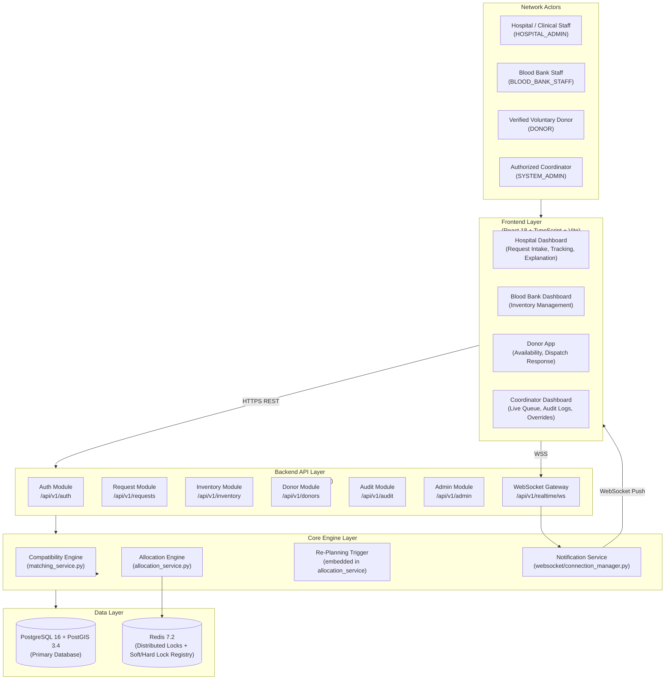

# System Architecture
# SmartBlood — Smart Blood & Emergency Donor Network

**Version:** 1.0  
**Stack Source:** Stack.md  
**PRD Source:** PRD.md  

---

## 1. Architecture Overview

SmartBlood uses a **modular monolith** backend architecture implemented as a single FastAPI application with clearly separated internal modules. This approach is chosen deliberately for the prototype because:
- It simplifies local setup, debugging, and demonstration.
- It avoids the operational overhead of microservices (separate deployments, service discovery, distributed tracing) that is not warranted for a prototype.
- The module boundaries are clearly defined, so individual modules can be extracted into independent services in a future production deployment without rewriting business logic.

### Architectural Boundaries

| Boundary | Technology | Notes |
|:---------|:-----------|:------|
| Frontend | React 18 + TypeScript + Vite | Role-specific dashboards; communicates via REST and WebSocket |
| Backend / API | FastAPI (Python 3.12) | Modular monolith; async throughout |
| Authentication / Authorization | JWT + RBAC (python-jose, passlib/bcrypt) | Stateless; enforced at API layer |
| Emergency Request Management | requests module (FastAPI router + service) | Handles request lifecycle state machine |
| Resource Management | inventory module, donor module | Inventory FEFO queries; donor proximity queries |
| Compatibility Engine | matching_service (Python module) | Stateless deterministic lookup |
| Allocation / Optimization Engine | allocation_service (Python module) | Weighted multi-factor scoring; heuristic greedy |
| Re-planning Engine | Embedded in allocation_service; triggered by event hooks | Event-driven; fires on state-change triggers |
| Verification | Coordinator-managed flag on User/Donor/Hospital/BloodBank | Enforced at allocation filter step |
| Notification Service | WebSocket Connection Manager | In-process pub/sub; abstracted for future extension |
| Transportation Estimation | PostGIS ST_Distance + mock speed estimate | Location data in Geography(Point) columns |
| Database | PostgreSQL 16 + PostGIS 3.4 | Relational with spatial extension |
| Real-Time Event Mechanism | Native FastAPI WebSocket | Persistent connections; channel-based broadcast |
| Cache / Concurrency Locks | Redis 7.2 | Distributed soft locks and hard locks (atomic SET NX) |
| Audit Logging | AllocationAuditLog table (PostgreSQL) | Immutable; never deleted via API |

---

## 2. High-Level Architecture Diagram



---

## 3. Component Architecture

### 3.1 Auth Module (`app/api/v1/auth.py` + `app/core/security.py`)
- **Responsibility:** User registration, login, JWT issuance, password hashing, RBAC enforcement.
- **Inputs:** Registration payload (email, password, role); login credentials.
- **Outputs:** JWT access token; user profile object.
- **Dependencies:** PostgreSQL (User table), passlib/bcrypt, python-jose.
- **Business Rules:** Passwords are hashed before storage. JWT contains `user_id` and `role`. Tokens are verified on every protected endpoint via FastAPI dependency injection.

### 3.2 Emergency Request Module (`app/api/v1/requests.py` + request lifecycle)
- **Responsibility:** CRUD for BloodRequest entities; urgency score computation; allocation pipeline trigger.
- **Inputs:** Hospital creates request with blood group, component type, quantity, triage level, deadline.
- **Outputs:** BloodRequest record; urgency score; allocation pipeline kick-off.
- **Dependencies:** PostgreSQL (blood_requests table), Allocation Engine (via service call), Notification Service.
- **Business Rules:** Urgency score is computed using `matching_service.calculate_urgency_score()` at creation and on update. New request triggers `execute_allocation_pipeline()`. Status follows the defined state machine.

### 3.3 Donor Module (`app/api/v1/donors.py` + `app/repositories/donor_repo.py`)
- **Responsibility:** Donor registration and profile management; availability toggle; location update; dispatch response.
- **Inputs:** Donor profile data; availability flag; location coordinates; accept/decline response.
- **Outputs:** Updated donor record; hard-lock claim result; stand-down broadcasts.
- **Dependencies:** PostgreSQL (donors table with Geography column), Redis (soft/hard lock operations), PostGIS (ST_DWithin proximity queries), Notification Service.
- **Business Rules:** `find_eligible_donors_in_proximity()` uses `ST_DWithin` with SRID 4326. Only `is_available = true` and verified donors enter the candidate pool. First-accept triggers atomic hard lock upgrade via Redis SET NX.

### 3.4 Inventory Module (`app/api/v1/inventory.py` + `app/repositories/inventory_repo.py`)
- **Responsibility:** Blood unit CRUD; status management; FEFO-ordered availability queries; reservation lock management.
- **Inputs:** Blood unit registration data; status update requests.
- **Outputs:** InventoryUnit records; FEFO-ordered compatible unit lists.
- **Dependencies:** PostgreSQL (inventory_units table), Redis (lock TTL on LOCKED_RESERVE units).
- **Business Rules:** FEFO ordering: `ORDER BY expiry_date ASC`. Queries filter `status = AVAILABLE AND expiry_date > NOW()`. `lock_expires_at` is checked against current time for stale-lock detection.

### 3.5 Compatibility Engine (`app/services/matching_service.py`)
- **Responsibility:** Deterministic ABO/Rh compatibility lookup; urgency score calculation; proximity score computation.
- **Inputs:** Recipient blood group; component type (RBC or plasma path); triage level; deadline; distance_km.
- **Outputs:** List of compatible donor blood groups; urgency score float (0-100); proximity score float (0.0-1.0).
- **Dependencies:** None (pure Python; stateless).
- **Business Rules:** RBC compatibility matrix and plasma compatibility matrix are statically defined Python dicts. Same input always produces same output. No external API calls.

### 3.6 Allocation Engine (`app/services/allocation_service.py`)
- **Responsibility:** End-to-end allocation pipeline: compatibility filter -> inventory query (FEFO) -> donor proximity query -> scoring -> soft lock -> broadcast -> hard-lock claim -> audit log.
- **Inputs:** BloodRequest ID; initial search radius (km).
- **Outputs:** Allocation record; AllocationAuditLog; request status update; donor soft-lock set; broadcast trigger.
- **Dependencies:** CompatibilityEngine, DonorRepository, InventoryRepository, Redis (ConcurrencyLockManager), PostgreSQL, NotificationService.
- **Business Rules:** Inventory-first; donor-fallback. Heuristic greedy scoring (described in Section 6). FEFO applied to inventory. Donor reliability_score factored in candidate scoring.

### 3.7 Re-Planning Module (embedded in `allocation_service.py`)
- **Responsibility:** Detect trigger events; release invalidated locks; re-execute allocation pipeline; produce new recommendation; notify actors.
- **Inputs:** Trigger event type and affected resource/request IDs.
- **Outputs:** New Allocation record; updated AllocationAuditLog; request status back to `PENDING_EVALUATION` or `RE_PLANNING`; WebSocket notification.
- **Dependencies:** AllocationEngine, RedisLockManager, NotificationService.
- **Business Rules:** See PRD.md Section 13 for full trigger event list and constraints.

### 3.8 Verification Module (flag management in User/Hospital/BloodBank/Donor models)
- **Responsibility:** Track and enforce verification status of actors and resources.
- **Inputs:** Admin sets `is_verified` flag via admin API.
- **Outputs:** Verified/unverified state on records; filter applied during allocation.
- **Dependencies:** PostgreSQL (is_verified columns), RBAC (SYSTEM_ADMIN only).
- **Business Rules:** Unverified donors are excluded from proximity broadcast. Unverified hospitals cannot create requests.

### 3.9 Notification Service (`app/websocket/connection_manager.py`)
- **Responsibility:** Maintain active WebSocket connections per client; broadcast events to specific roles or individuals.
- **Inputs:** Event type; target audience (hospital_id, donor_id, blood_bank_id, or role-wide).
- **Outputs:** WebSocket push messages to connected clients.
- **Dependencies:** FastAPI WebSocket infrastructure.
- **Business Rules:** Best-effort delivery. A disconnected client's missed events are not replayed. Future SMS/email integration can be plugged into the notification abstraction layer without changing core allocation logic.

### 3.10 Transportation Estimation
- **Responsibility:** Estimate travel time between a resource location and the hospital.
- **Inputs:** Source coordinates (lat, lng); destination coordinates (hospital lat, lng).
- **Outputs:** Estimated distance (km); estimated transit time (minutes).
- **Dependencies:** PostGIS `ST_Distance` function.
- **Business Rules (Implementation Decision):** Travel time estimate = distance_km / assumed_average_speed_kmh. Default assumed speed is configurable. This is a mock estimate for the prototype. A real routing API (e.g., Google Maps, OSRM) can be integrated later by implementing the same interface.

### 3.11 Admin Module (`app/api/v1/admin.py` if implemented, or via coordinator SYSTEM_ADMIN role on existing endpoints)
- **Responsibility:** System-wide overview; manual allocation overrides; verification management.
- **Inputs:** Coordinator actions (override, verify actor).
- **Outputs:** Updated allocation records; system-wide queue state; audit log entries for overrides.
- **Dependencies:** All modules; RBAC (SYSTEM_ADMIN required).

### 3.12 Audit Module (`app/api/v1/audit.py`)
- **Responsibility:** Read-only access to AllocationAuditLog records; allocation explanation endpoint.
- **Inputs:** Request ID (for explanation); pagination params (for audit log list).
- **Outputs:** AllocationAuditLog records.
- **Dependencies:** PostgreSQL (allocation_audit_logs table).
- **Business Rules:** No write or delete operations available via API. Only SYSTEM_ADMIN and HOSPITAL_ADMIN (for own requests) may access.

---

## 4. Frontend Architecture

### 4.1 Overview
The frontend is built with React 18, TypeScript, and Vite. It connects to the backend via:
- **REST API** (HTTPS): `http://localhost:8000/api/v1`
- **WebSocket** (WSS): `ws://localhost:8000/api/v1/realtime/ws`

State management uses React Context or lightweight state (no Redux required for prototype). API calls use the native `fetch` API or `axios`. WebSocket connection is maintained with auto-reconnect.

### 4.2 Role-Specific Dashboards

#### Hospital Dashboard (HOSPITAL_ADMIN)
**Screens:**
1. **Emergency Request Intake Screen**
   - Input: blood group selector, component type, quantity, triage level, deadline datetime picker, patient ID token.
   - Action: POST /api/v1/requests
   - On success: redirect to Live Tracking screen.

2. **Live Request Tracking & Allocation View**
   - Shows: request status pill (PENDING_EVALUATION -> PROXIMITY_ZONE_NOTIFIED -> COMMITTED_IN_TRANSIT, etc.); real-time ETA; matched resource identifier; expandable allocation explanation panel.
   - Data: GET /api/v1/requests/{id}; GET /api/v1/audit/requests/{id}/explanation; WebSocket live updates.
   - Action: Cancel request (PATCH /api/v1/requests/{id}/cancel).

#### Blood Bank Dashboard (BLOOD_BANK_STAFF)
**Screens:**
1. **Inventory Management Screen**
   - Shows: table of inventory units with blood group, component type, expiry date, status, lock state.
   - Actions: Register new unit (POST /api/v1/inventory/units); update unit status (PATCH /api/v1/inventory/units/{id}/status).
   - Data: GET /api/v1/inventory; WebSocket updates for lock events.

#### Donor Dashboard (DONOR)
**Screens:**
1. **Availability & Status Screen**
   - Shows: availability toggle; donor profile summary; last donation date; reliability score.
   - Action: PATCH /api/v1/donors/availability (toggle is_available, update location).

2. **Emergency Dispatch Action Screen**
   - Triggered by: incoming WebSocket dispatch notification.
   - Shows: hospital name, component needed, distance estimate, response countdown timer.
   - Actions: Accept (POST /api/v1/donors/requests/{id}/respond with action=ACCEPT); Decline (action=DECLINE).
   - On Accept (hard lock claimed): shows confirmation; on race condition conflict: shows stand-down message.

#### Coordinator Dashboard (SYSTEM_ADMIN)
**Screens:**
1. **Live Queue Monitor**
   - Shows: all active requests sorted by urgency score; live allocation events feed; re-planning alerts.
   - Actions: Manual override (POST /api/v1/admin/allocations/{id}/override).
   - Data: GET /api/v1/admin/overview; GET /api/v1/requests; WebSocket.

2. **Audit & Explainability Screen**
   - Shows: searchable list of AllocationAuditLog records; full explanation view per decision.
   - Data: GET /api/v1/audit/logs; GET /api/v1/audit/requests/{id}/explanation.

---

## 5. Backend Architecture

The backend is a FastAPI application structured as follows:

```
backend/app/
├── main.py                  # Application entry point, CORS, lifespan, router registration
├── core/
│   ├── config.py            # Environment settings (Pydantic Settings)
│   ├── database.py          # SQLAlchemy async engine, session factory, Base
│   ├── redis.py             # Async Redis client, ConcurrencyLockManager
│   ├── security.py          # JWT encode/decode, bcrypt password hash/verify
│   ├── permissions.py       # RBAC role dependency guards
│   └── exceptions.py        # DomainException, AllocationRaceConditionError
├── models/
│   ├── base.py              # TimestampedModel (id, created_at, updated_at)
│   ├── user.py              # User model + UserRole enum
│   ├── hospital.py          # Hospital model with Geography(Point)
│   ├── blood_bank.py        # BloodBank model with Geography(Point)
│   ├── donor.py             # Donor model with Geography(Point), reliability_score
│   ├── inventory.py         # InventoryUnit model, BloodComponentType, UnitStatus
│   ├── request.py           # BloodRequest model, TriageLevel, RequestStatus
│   ├── allocation.py        # Allocation model, AllocationSourceType, AllocationStatus
│   └── audit.py             # AllocationAuditLog model
├── schemas/
│   ├── auth.py              # RegisterRequest, LoginRequest, TokenResponse
│   ├── request.py           # CreateBloodRequestSchema, RequestResponse
│   ├── donor.py             # DonorProfile, AvailabilityUpdate, DispatchResponse
│   ├── inventory.py         # CreateInventoryUnit, InventoryUnitResponse, StatusUpdate
│   └── audit.py             # AllocationExplanationResponse, AuditLogResponse
├── repositories/
│   ├── base.py              # GenericAsyncRepository (get, list, create, update)
│   ├── donor_repo.py        # DonorRepository: find_eligible_donors_in_proximity (ST_DWithin)
│   └── inventory_repo.py    # InventoryRepository: find_compatible_units_with_lock (FEFO)
├── services/
│   ├── matching_service.py  # CompatibilityEngine, urgency scoring, proximity scoring
│   └── allocation_service.py# AllocationService: pipeline, donor response, re-planning
├── api/
│   ├── deps.py              # get_current_user, require_role, get_db, get_redis
│   └── v1/
│       ├── router.py        # api_router aggregating all sub-routers
│       ├── auth.py          # /auth endpoints
│       ├── requests.py      # /requests endpoints
│       ├── donors.py        # /donors endpoints
│       ├── inventory.py     # /inventory endpoints
│       ├── audit.py         # /audit endpoints
│       └── admin.py         # /admin endpoints (SYSTEM_ADMIN only)
└── websocket/
    ├── connection_manager.py# ConnectionManager: connect, disconnect, broadcast
    └── routes.py            # /realtime/ws WebSocket upgrade endpoint
```

### Backend Module Summary

| Module | File(s) | Responsibility |
|:-------|:--------|:---------------|
| Auth | core/security.py, api/v1/auth.py | Password hashing, JWT, login, register |
| User | models/user.py, schemas/auth.py | User entity, role enum |
| Emergency Request | models/request.py, api/v1/requests.py | Request CRUD, urgency score, state machine |
| Donor | models/donor.py, repositories/donor_repo.py, api/v1/donors.py | Donor profile, proximity query, dispatch response |
| Blood Bank | models/blood_bank.py, api/v1/* | Blood bank entity management |
| Inventory | models/inventory.py, repositories/inventory_repo.py, api/v1/inventory.py | Blood unit CRUD, FEFO query, status management |
| Compatibility | services/matching_service.py | ABO/Rh matrix lookups, urgency formula, proximity score |
| Allocation | services/allocation_service.py | Full allocation pipeline, scoring, locking, FEFO |
| Re-planning | services/allocation_service.py (re-plan methods) | Trigger detection, lock release, pipeline re-execution |
| Verification | models/user.py, models/donor.py, api/v1/admin.py | is_verified flag management, filter enforcement |
| Notification | websocket/connection_manager.py | WebSocket channel management, broadcast |
| Transportation | services/matching_service.py (proximity score) | Distance-based travel time mock estimate |
| Audit | models/audit.py, api/v1/audit.py | Immutable AllocationAuditLog read access |

---

## 6. Allocation Engine Architecture

This is the most critical technical component.

### 6.1 Algorithm Classification
The allocation engine uses a **heuristic greedy weighted-scoring** approach. It does not claim to find a mathematically globally optimal solution. For each active request, it greedily selects the highest-scored feasible candidate from the available pool at the time of evaluation.

**Justification:** A heuristic greedy approach is sufficient for the prototype to demonstrate dynamic multi-factor allocation, explainability, and re-planning. It is deterministic, traceable, and computationally lightweight.

### 6.2 Deterministic Allocation Pipeline

```
RECEIVE:  BloodRequest (id, required_blood_group, component_type,
                        units_requested, triage_level, deadline_at,
                        hospital.latitude, hospital.longitude)

STEP 1: COMPATIBILITY FILTER
  - is_plasma = (component_type == FFP or CRYOPRECIPITATE)
  - compatible_groups = MatchingEngineService.get_compatible_donor_types(
        required_blood_group, is_plasma=is_plasma)
  Result: list of compatible blood group strings

STEP 2: INVENTORY QUERY (FEFO)
  - Query: inventory_units WHERE
        blood_group IN (compatible_groups)
        AND component_type = request.component_type
        AND status = AVAILABLE
        AND expiry_date > NOW()
    ORDER BY expiry_date ASC
    LIMIT units_requested
  - If sufficient units found -> proceed to STEP 2a
  - Else -> proceed to STEP 3 (donor broadcast)

STEP 2a: INVENTORY RESERVATION
  - Acquire Redis soft lock on each selected unit (TTL configured)
  - Update unit.status = LOCKED_RESERVE, unit.lock_expires_at = now + TTL
  - Create Allocation record (source_type=BLOOD_BANK_INVENTORY, status=HARD_LOCKED)
  - Compute proximity_score = MatchingEngineService.compute_proximity_score(
        blood_bank.distance_to_hospital_km)
  - Create AllocationAuditLog:
        decision_type = INVENTORY_MATCH
        urgency_score = request.calculated_urgency_score
        candidate_scores_json = {unit_id, expiry_date, proximity_score}
        rationale_summary = "Inventory match: unit {batch} FEFO selected. ..."
  - Update request.status = COMMITTED_IN_TRANSIT
  - Broadcast ALLOCATION_MATCHED notification to hospital
  DONE.

STEP 3: DONOR PROXIMITY BROADCAST
  - Query: donors WHERE
        blood_group IN (compatible_groups)
        AND is_available = true
        AND is_verified = true
        AND ST_DWithin(location, hospital_location, radius_meters)
    ORDER BY ST_Distance(location, hospital_location) ASC
  - If no donors found:
        Expand radius (Implementation Decision: radius_km * 2, up to configured max)
        Repeat STEP 3
        If still none: request.status = RE_PLANNING; notify hospital; DONE.
  - Apply Redis soft locks to ALL found donors simultaneously (non-exclusive, TTL = 180s)
  - Create Allocation record per donor (status=SOFT_LOCKED)
  - Broadcast proximity-zone dispatch notification to ALL found donors simultaneously
  - Update request.status = PROXIMITY_ZONE_NOTIFIED
  - Start TTL watchdog (Re-planning engine handles timeout)
  Wait for first-ack response...

STEP 4: FIRST-ACK HARD LOCK (triggered by donor ACCEPT response)
  - Redis atomic compare-and-swap: SET request:{id}:hard_lock = donor_id NX EX ttl
  - If SET succeeds (this donor wins):
        Upgrade Allocation status -> HARD_LOCKED
        Release all other donor soft locks
        Send stand-down notifications to all other zone donors
        request.status = COMMITTED_IN_TRANSIT
        Compute distance_km and estimated_transit_minutes
        Write AllocationAuditLog (decision_type = FIRST_ACK_CLAIM)
        Broadcast MATCH_CONFIRMED to hospital with donor ETA
  - If SET fails (another donor already claimed):
        Return AllocationRaceConditionError to this donor
        Send stand-down notification to this donor

STEP 5: RE-PLANNING (triggered by cancellation, timeout, quarantine, etc.)
  - Release invalidated lock (Redis + DB status update)
  - Set Allocation status -> RE_OPTIMIZED or CANCELLED_BY_DONOR or TIMED_OUT
  - Set request.status -> RE_PLANNING
  - Broadcast RE_PLANNING notification to hospital
  - Re-execute from STEP 1 (or STEP 3 with expanded radius if inventory already exhausted)
  - Write AllocationAuditLog (decision_type = RE_PLAN_ALTERNATIVE)
```

### 6.3 Scoring Factors (Implementation Decision)
The greedy selection within each candidate pool is ordered by these factors:
- **Inventory candidates:** FEFO (expiry_date ASC) primary; proximity_score secondary.
- **Donor candidates:** Initial ordering by PostGIS distance ASC; reliability_score used as a secondary sort within equidistant candidates.

> **Implementation Decision:** The exact numeric weights for combining proximity_score and reliability_score into a single composite donor score are defined in `allocation_service.py` and may be tuned without changing the documented architecture. They must be captured in `candidate_scores_json` for every audit log entry.

### 6.4 Explanation Generation
For every allocation decision:
1. The allocation pipeline records all evaluated candidates and their computed scores in `candidate_scores_json`.
2. It generates a natural-language `rationale_summary` string using the actual factor values.
3. Both are written to `AllocationAuditLog` atomically within the same DB transaction as the Allocation record.
4. The `/api/v1/audit/requests/{id}/explanation` endpoint retrieves and returns this record.

---

## 7. Re-Planning Architecture

Re-planning is event-driven, embedded within the allocation service. The flow is:

```
EVENT DETECTED
  (donor cancels / lock TTL expires / unit quarantined / new request / etc.)
      |
      v
IDENTIFY AFFECTED REQUEST(S)
  - For donor cancel/timeout: request ID from allocation record
  - For unit status change:   find request with soft lock on this unit
  - For new high-urgency req: all active requests in PENDING_EVALUATION or RE_PLANNING
      |
      v
RELEASE INVALIDATED RESOURCES
  - Redis: delete soft lock keys for affected resources
  - DB:    Allocation.status -> TIMED_OUT / CANCELLED_BY_DONOR / RE_OPTIMIZED
  - DB:    InventoryUnit.status -> AVAILABLE (if was LOCKED_RESERVE)
      |
      v
SET REQUEST STATUS -> RE_PLANNING
BROADCAST RE_PLANNING NOTIFICATION to hospital (WebSocket)
      |
      v
RE-EXECUTE ALLOCATION PIPELINE (STEP 1 onwards)
      |
      v
NEW RECOMMENDATION GENERATED
      |
      v
WRITE NEW AllocationAuditLog (decision_type = RE_PLAN_ALTERNATIVE)
BROADCAST NEW_RECOMMENDATION / ALTERNATIVE_FOUND to hospital
```

**Radius Expansion Logic (Implementation Decision):**
- Initial search radius: configurable (default 5 km).
- First expansion: 2x initial radius.
- Second expansion: 3x initial radius, up to a configured maximum.
- If maximum radius reached with no candidates: request stays in `RE_PLANNING`, hospital is notified.

---

## 8. Real-Time Architecture

### 8.1 Technology
Real-time updates are delivered via **native FastAPI WebSocket connections** managed by a `ConnectionManager` class. This technology is used because:
- It is built into the FastAPI/uvicorn stack with no additional dependencies.
- It provides full-duplex communication suitable for push notifications.
- It is straightforward to demonstrate in a prototype.

### 8.2 Connection Lifecycle
1. Client connects to `ws://host/api/v1/realtime/ws` with a valid JWT in the query string or headers.
2. `ConnectionManager.connect()` stores the connection indexed by `user_id` and `role`.
3. Backend services call `ConnectionManager.broadcast_to_user(user_id, message)` or `ConnectionManager.broadcast_to_role(role, message)` to push events.
4. On disconnect, the connection is removed from the manager.

### 8.3 Message Format (Implementation Decision)
```json
{
  "event_type": "ALLOCATION_MATCHED | PROXIMITY_ZONE_NOTIFIED | RE_PLANNING | ...",
  "request_id": "uuid",
  "payload": { ... event-specific data ... },
  "timestamp": "ISO8601"
}
```

### 8.4 Limitations
- WebSocket events are best-effort. Missed events (due to disconnect) are not replayed from a persistent queue.
- No external message broker (Redis Pub/Sub, Kafka, etc.) is used in the prototype. For production scale, the connection manager can be backed by Redis Pub/Sub to support multiple backend instances.

---

## 9. Database Architecture

### 9.1 Technology
PostgreSQL 16 with PostGIS 3.4 extension. PostGIS is required for:
- `Geography(Point, SRID=4326)` columns on Hospital, BloodBank, and Donor tables.
- `ST_DWithin()` for proximity radius queries.
- `ST_Distance()` for distance calculations.

ORM: SQLAlchemy 2.0 (async, using `asyncpg` driver). Migrations: Alembic.

### 9.2 Table Definitions

**users**
```
id              VARCHAR PRIMARY KEY
email           VARCHAR UNIQUE NOT NULL
hashed_password VARCHAR NOT NULL
role            ENUM(HOSPITAL_ADMIN, BLOOD_BANK_STAFF, DONOR, SYSTEM_ADMIN) NOT NULL
is_active       BOOLEAN DEFAULT TRUE
is_verified     BOOLEAN DEFAULT FALSE
created_at      TIMESTAMPTZ NOT NULL DEFAULT NOW()
updated_at      TIMESTAMPTZ
```

**hospitals**
```
id              VARCHAR PRIMARY KEY
user_id         VARCHAR FK -> users.id ON DELETE CASCADE UNIQUE
name            VARCHAR NOT NULL
address         VARCHAR
contact_phone   VARCHAR
latitude        FLOAT
longitude       FLOAT
location        GEOGRAPHY(POINT, 4326)
is_verified     BOOLEAN DEFAULT FALSE
created_at      TIMESTAMPTZ
updated_at      TIMESTAMPTZ
```

**blood_banks**
```
id              VARCHAR PRIMARY KEY
user_id         VARCHAR FK -> users.id ON DELETE CASCADE UNIQUE
name            VARCHAR NOT NULL
address         VARCHAR
contact_phone   VARCHAR
latitude        FLOAT
longitude       FLOAT
location        GEOGRAPHY(POINT, 4326)
is_verified     BOOLEAN DEFAULT FALSE
created_at      TIMESTAMPTZ
updated_at      TIMESTAMPTZ
```

**donors**
```
id                        VARCHAR PRIMARY KEY
user_id                   VARCHAR FK -> users.id ON DELETE CASCADE UNIQUE
blood_group               VARCHAR NOT NULL INDEX
date_of_birth             DATE NOT NULL
weight_kg                 FLOAT NOT NULL
last_donation_date        DATE
is_available              BOOLEAN DEFAULT TRUE INDEX
reliability_score         FLOAT DEFAULT 1.0
total_successful_donations INTEGER DEFAULT 0
location                  GEOGRAPHY(POINT, 4326)
latitude                  FLOAT
longitude                 FLOAT
created_at                TIMESTAMPTZ
updated_at                TIMESTAMPTZ
```

**inventory_units**
```
id              VARCHAR PRIMARY KEY
blood_bank_id   VARCHAR FK -> blood_banks.id ON DELETE CASCADE
batch_number    VARCHAR UNIQUE NOT NULL INDEX
blood_group     VARCHAR NOT NULL INDEX
component_type  ENUM(WHOLE_BLOOD, PRBC, PLATELETS, FFP, CRYOPRECIPITATE) NOT NULL
volume_ml       FLOAT NOT NULL DEFAULT 450.0
collection_date TIMESTAMPTZ NOT NULL
expiry_date     TIMESTAMPTZ NOT NULL INDEX
status          ENUM(AVAILABLE, LOCKED_RESERVE, DISPATCHED, TRANSFUSED, EXPIRED, QUARANTINED)
                DEFAULT AVAILABLE INDEX
lock_expires_at TIMESTAMPTZ
created_at      TIMESTAMPTZ
updated_at      TIMESTAMPTZ
```

**blood_requests**
```
id                       VARCHAR PRIMARY KEY
hospital_id              VARCHAR FK -> hospitals.id ON DELETE CASCADE
patient_id_token         VARCHAR NOT NULL INDEX
required_blood_group     VARCHAR NOT NULL INDEX
component_type           ENUM(...) NOT NULL
units_requested          INTEGER NOT NULL DEFAULT 1
triage_level             ENUM(MASSIVE_TRANSFUSION_PROTOCOL, ACTIVE_TRAUMA,
                              SCHEDULED_EMERGENCY_RESERVE, ROUTINE_CLINICAL) NOT NULL
calculated_urgency_score FLOAT DEFAULT 0.0
deadline_at              TIMESTAMPTZ NOT NULL
status                   ENUM(PENDING_EVALUATION, PROXIMITY_ZONE_NOTIFIED,
                              COMMITTED_IN_TRANSIT, RE_PLANNING,
                              FULFILLED, CANCELLED, EXPIRED)
                         DEFAULT PENDING_EVALUATION INDEX
created_at               TIMESTAMPTZ
updated_at               TIMESTAMPTZ
```

**allocations**
```
id                       VARCHAR PRIMARY KEY
request_id               VARCHAR FK -> blood_requests.id ON DELETE CASCADE
source_type              ENUM(BLOOD_BANK_INVENTORY, LIVE_DONOR) NOT NULL
inventory_unit_id        VARCHAR FK -> inventory_units.id NULLABLE
donor_id                 VARCHAR FK -> donors.id NULLABLE
status                   ENUM(SOFT_LOCKED, HARD_LOCKED, IN_TRANSIT, COMPLETED,
                              CANCELLED_BY_DONOR, TIMED_OUT, RE_OPTIMIZED)
                         DEFAULT SOFT_LOCKED INDEX
estimated_transit_minutes FLOAT
distance_km              FLOAT
allocated_at             TIMESTAMPTZ
completed_at             TIMESTAMPTZ
created_at               TIMESTAMPTZ
updated_at               TIMESTAMPTZ
```

**allocation_audit_logs**
```
id                    VARCHAR PRIMARY KEY
request_id            VARCHAR FK -> blood_requests.id
decision_type         VARCHAR NOT NULL
urgency_score         FLOAT
candidate_scores_json JSONB
selected_resource_id  VARCHAR
rationale_summary     TEXT
created_at            TIMESTAMPTZ NOT NULL DEFAULT NOW()
-- NO updated_at: immutable record
```

### 9.3 Key Relationships
- User 1:1 Hospital (or BloodBank, or Donor) — role determines which profile exists.
- Hospital 1:N BloodRequest.
- BloodBank 1:N InventoryUnit.
- BloodRequest 1:N Allocation (multiple allocation attempts over re-planning cycles).
- BloodRequest 1:N AllocationAuditLog (one entry per allocation decision).
- Allocation N:1 InventoryUnit (nullable) or Donor (nullable).

### 9.4 Spatial Indexes
PostGIS GIST spatial indexes are created on `donors.location`, `hospitals.location`, and `blood_banks.location` to support efficient `ST_DWithin` queries.

---

## 10. State Machines

### 10.1 EmergencyRequest (BloodRequest) States

```
                    [Created]
                       |
                       v
              PENDING_EVALUATION
              /                 \
  Inventory found            Inventory depleted,
  (hard lock placed)          donor broadcast sent
             |                       |
             v                       v
  COMMITTED_IN_TRANSIT   PROXIMITY_ZONE_NOTIFIED
             |                       |
             |         First donor accepts (hard lock)
             |                       |
             v                       v
         FULFILLED <-- COMMITTED_IN_TRANSIT
             
  From any non-terminal state:
  - Hospital cancels -> CANCELLED
  - Deadline passes without fulfilment -> EXPIRED
  - Resource fails / timeout -> RE_PLANNING
        |
        v
     RE_PLANNING
        |
        v (re-execute pipeline)
  PENDING_EVALUATION (or directly to PROXIMITY_ZONE_NOTIFIED / COMMITTED_IN_TRANSIT)
```

**Terminal states:** FULFILLED, CANCELLED, EXPIRED.

### 10.2 InventoryUnit States

```
AVAILABLE
    |
    | (allocation engine soft lock)
    v
LOCKED_RESERVE
    |          \
    | (confirm)  (TTL expires or request cancelled)
    v              \
DISPATCHED        AVAILABLE (lock released)
    |
    v
TRANSFUSED

From any non-terminal state:
    -> EXPIRED   (expiry_date passed)
    -> QUARANTINED (blood bank staff marks it)
```

**Terminal states:** TRANSFUSED, EXPIRED, QUARANTINED.

### 10.3 Allocation States

```
SOFT_LOCKED
    |           \
    | (first-ack  (TTL expires or all donors decline)
    |  donor)       \
    v                v
HARD_LOCKED       TIMED_OUT
    |
    | (donor signals in-transit or delivery confirmed)
    v
IN_TRANSIT
    |          \
    | (success) (donor cancels)
    v              \
COMPLETED       CANCELLED_BY_DONOR -> triggers RE_PLANNING on request
                    |
                    v
                RE_OPTIMIZED
```

**Terminal states:** COMPLETED, TIMED_OUT, RE_OPTIMIZED.

---

## 11. Consistency and Concurrency

### 11.1 Race Condition Scenario
Two donors (D1 and D2) in the same proximity zone simultaneously tap ACCEPT for Request R. Without protection, both could create an Allocation record, leading to double-allocation.

### 11.2 Solution: Redis Atomic Compare-And-Swap
The `ConcurrencyLockManager` in `app/core/redis.py` uses Redis `SET NX EX` (Set if Not eXists, with expiry):

```python
# acquire_hard_lock(request_id, donor_id):
result = await redis.set(
    f"hardlock:request:{request_id}",
    donor_id,
    nx=True,          # Only set if key does not exist
    ex=ttl_seconds    # Auto-expire to prevent permanent lock on failure
)
# If result is True: this donor wins. Others get False -> AllocationRaceConditionError.
```

### 11.3 Soft Locks
Soft locks are non-exclusive Redis keys per donor-request pair:
```
softlock:donor:{donor_id}:request:{request_id}  TTL=180s
```
Multiple soft locks can coexist. They are released when a hard lock is claimed or the request is cancelled.

### 11.4 Database Transactions
All writes within the allocation pipeline (Allocation record + AllocationAuditLog + BloodRequest status update + InventoryUnit status update) are wrapped in a single SQLAlchemy async transaction. On commit failure, the entire set rolls back and the pipeline returns an error.

### 11.5 Idempotency
The allocation pipeline checks whether a hard lock already exists in Redis before creating a new Allocation record. If a hard lock already exists for the request, the pipeline short-circuits and returns the existing allocation.

### 11.6 Stale Lock Detection
The `lock_expires_at` column on `InventoryUnit` is checked during availability queries. Units where `lock_expires_at < NOW()` but status is still `LOCKED_RESERVE` are treated as available and their status is reset.

---

## 12. Security Architecture

### 12.1 Authentication
- **Mechanism:** OAuth2 Password Flow with JWT Bearer tokens.
- **Token Content:** `user_id`, `role`, `exp` (expiry timestamp).
- **Token Signing:** HS256 with a secret key loaded from environment variable `SECRET_KEY`.
- **Expiry:** Configurable via `ACCESS_TOKEN_EXPIRE_MINUTES` env var.

### 12.2 Authorization (RBAC)
- Every protected endpoint declares required roles via FastAPI dependency: `require_role([UserRole.HOSPITAL_ADMIN])`.
- Roles are enforced at the API layer before any service logic executes.
- Object-level authorization (hospital can only see its own requests) is enforced within the service/repository layer by filtering on `hospital_id`.

### 12.3 Input Validation
- All request bodies are validated via Pydantic v2 schemas before the route handler executes.
- Invalid types, missing required fields, out-of-range values, and invalid enum values return HTTP 422 with structured error details.

### 12.4 Password Handling
- Registration: password is immediately hashed with `passlib.bcrypt`. Plaintext is discarded.
- Login: provided password is verified against the stored hash using `passlib.verify`. Plaintext is never logged.
- Reset/change: not implemented in prototype (Implementation Decision).

### 12.5 API Security
- CORS is configured via FastAPI middleware. Origins are set from environment variables.
- Rate limiting: not implemented in prototype (Implementation Decision — can be added via a middleware layer).

### 12.6 Audit Logging
- All allocation decisions and critical state changes are persisted to `allocation_audit_logs`.
- Audit records have no update or delete API endpoints.
- SYSTEM_ADMIN and HOSPITAL_ADMIN (for own requests) can read audit logs.

### 12.7 Sensitive Data Minimisation
- `patient_id_token` is an opaque token — the system does not validate or process it as real PII.
- Donor latitude/longitude is used only for proximity calculations; full coordinates are not returned to hospital-role API responses.

---

## 13. Privacy

- The prototype uses **synthetic data only**. No real patient, donor, or hospital data is used.
- Donor location data is stored and queried server-side. The exact coordinates are not returned to hospital users via any API endpoint.
- The `patient_id_token` field stores an opaque identifier supplied by the hospital; the system treats it as an opaque string.
- No third-party analytics or telemetry services are used.

---

## 14. Failure Handling

| Failure Scenario | Detection | System Response | User-Visible Effect |
|:-----------------|:----------|:----------------|:--------------------|
| Database unavailable at startup | SQLAlchemy connect error in lifespan | Warning logged; startup continues in degraded mode | API returns 503 on DB-dependent endpoints |
| Redis unavailable | redis.py connection error | AllocationRaceConditionError raised | API returns 503 for allocation endpoints; soft/hard lock operations fail |
| Duplicate allocation attempt (race) | Redis SET NX returns False | AllocationRaceConditionError raised; HTTP 409 to second donor | Second donor sees "Request already claimed" message |
| Notification WebSocket failure | asyncio exception on send | Exception caught; log error; continue | Client misses this push event; state is still correct in DB |
| Invalid request payload | Pydantic validation failure | HTTP 422 returned immediately | User sees field-level validation errors |
| Stale inventory lock (lock_expires_at < NOW) | Detected in inventory query | Unit status reset to AVAILABLE; included in fresh query | Transparent; unit becomes available again |
| Donor soft lock TTL expires | Redis key expires | Re-planning trigger fires for affected requests | Hospital notified of re-planning |
| No compatible resource found | Empty candidate pool after radius expansion | Request set to RE_PLANNING | Hospital receives "no compatible resource found" notification |
| Concurrent DB write conflict | SQLAlchemy asyncpg exception | Transaction rolled back; error returned to caller | API returns 500; client can retry |

---

## 15. Observability

### 15.1 Application Logs
- Structured log events at INFO level for: request lifecycle transitions, allocation pipeline start/end, lock acquisitions/releases, re-planning triggers.
- ERROR level for: unhandled exceptions, Redis failures, database errors.
- Logger name: `smartblood`.

### 15.2 Audit Events
- All allocation decisions persisted to `allocation_audit_logs` table (PostgreSQL).
- Accessible via `/api/v1/audit/logs` (SYSTEM_ADMIN) and `/api/v1/audit/requests/{id}/explanation` (Hospital + Admin).

### 15.3 Allocation Decision Tracing
- Every call to `execute_allocation_pipeline()` writes an `AllocationAuditLog` record regardless of outcome (success, partial, or no candidates).

### 15.4 Performance Measurement (Implementation Decision)
- FastAPI middleware can be added to log request duration per endpoint.
- No external APM tool is required for the prototype.

### 15.5 Health Check
- `GET /health` endpoint returns `{"status": "healthy", "service": "...", "environment": "..."}`.
- Used for Docker health checks and manual verification.
