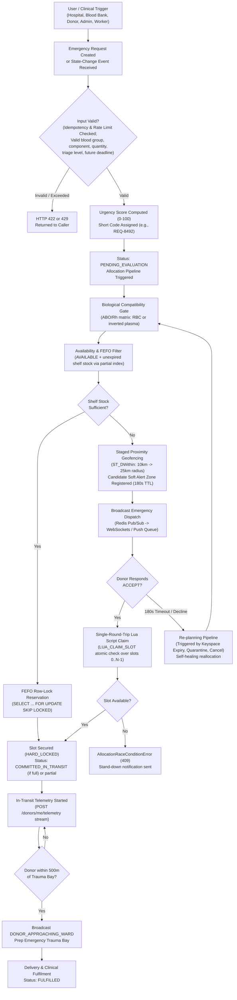
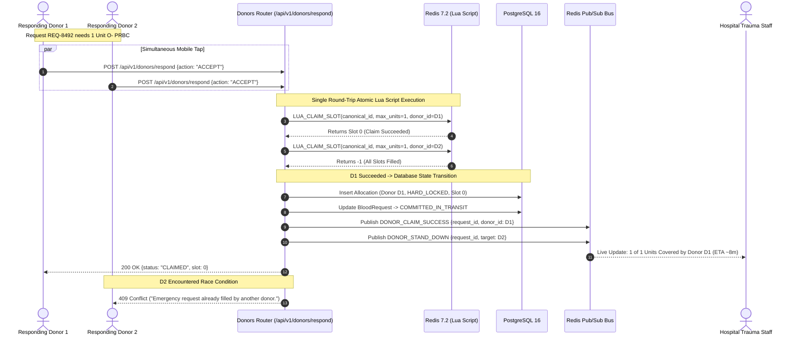
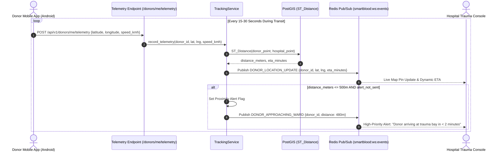
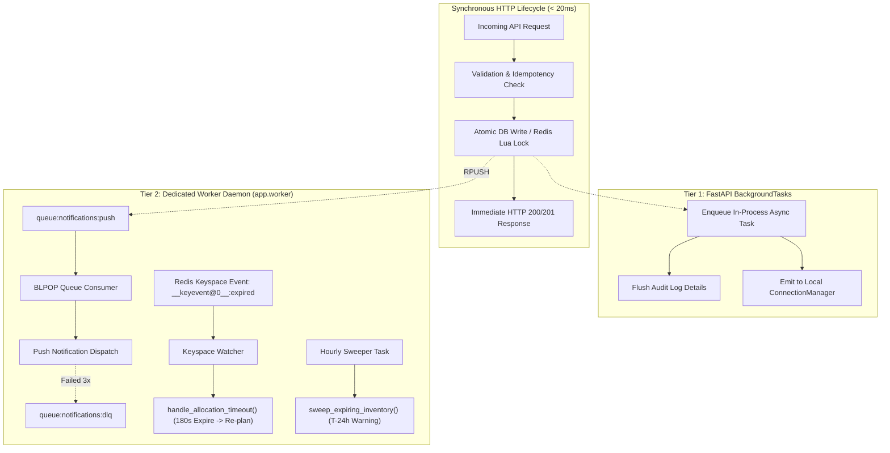

# System Workflow
# SmartBlood — Smart Blood & Emergency Donor Network

**Version:** 2.0  
**Stack Reference:** Stack.md  
**Architecture Reference:** ARCHITECTURE.md  
**PRD Reference:** PRD.md  
**Status Reference:** STATUS.md  

> All workflow descriptions use **synthetic data** for demonstration scenarios. No real patient, donor, hospital, or blood-bank data is used.

---

## 1. Overall Lifecycle Workflow

---

## 2. Emergency Request Workflow

### Step-by-Step Description

**Step 1: Hospital Clinician Creates Request**  
A hospital user (`role: HOSPITAL`) submits an emergency blood request via the Hospital Dashboard (`POST /api/v1/requests`).  
Headers: `Authorization: Bearer <jwt>`, optional `Idempotency-Key: <uuid>`.  
Payload: `required_blood_group`, `component_type`, `units_requested` (positive integer), `triage_level`, `deadline_at` (future timestamp), `patient_id_token` (opaque hospital identifier).

**Step 2: Security & Rate-Limit Gate**  
- `X-Request-ID` is extracted or generated for end-to-end tracing.
- If `Idempotency-Key` is present and exists in Redis, the cached response is returned immediately.
- Sliding-window rate limiter checks caller limits.
- Pydantic v2 validates types, blood groups, and future deadlines.

**Step 3: Scoring & Initial Insertion**  
- System assigns human-readable short code (e.g., `REQ-8492`).
- `calculated_urgency_score` is computed via `MatchingEngineService.calculate_urgency_score(triage_level, deadline_at)` (0-100).
- `BloodRequest` is committed with status `PENDING_EVALUATION`.
- Immutable `AllocationAuditLog` record is initialized.

**Step 4: Cold-Chain Inventory Query (FEFO)**  
- Biological compatibility matrix yields compatible donor groups.
- `inventory_repo.find_compatible_units_with_lock()` queries the partial index `idx_inventory_active_search` with row-level locks (`SELECT ... FOR UPDATE SKIP LOCKED`).
- If shelf stock covers the entire quantity:
  - Units transition to `LOCKED_RESERVE`.
  - `Allocation` created with `source_type=BLOOD_BANK_INVENTORY`, `status=HARD_LOCKED`.
  - Request status transitions directly to `COMMITTED_IN_TRANSIT`.
  - WebSocket broadcast `INVENTORY_LOCKED` dispatched to the hospital.

**Step 5: Staged Geofence Expansion (On Inventory Shortfall)**  
- If stock is insufficient, remaining units ($K$ shortfall) trigger donor proximity search.
- Initial geofence: 10 km radius via PostGIS `ST_DWithin`.
- Donors filtered for: `is_available = true`, verified, weight $\ge 50$ kg, and compliant with donation recovery interval (56 days for Whole Blood, 14 days for Platelets).
- Matched donor IDs registered in Redis SET `lock:soft:req:{id}:donors` with 180s TTL.
- Request transitions to `PROXIMITY_ZONE_NOTIFIED`.
- Fast WebSocket push and background notification queue emit dispatch alerts to candidate donors.

---

## 3. High-Concurrency Donor Response & Atomic Slot Claiming

---

## 4. In-Transit Real-Time GPS Telemetry & Ward Geofencing

Once a donor accepts or a courier is dispatched, real-time location streaming ensures hospital trauma teams can prepare surgical bays at the exact arrival moment.

---

## 5. Two-Tier Background Task & Worker Architecture

SmartBlood prevents API latency spikes and database deadlocks by offloading high-latency operations:

---

## 6. Self-Healing Re-Planning Workflows

Re-planning is event-driven and guarantees that requests do not remain stranded when real-world resources fail:

| Trigger Event | Detection Mechanism | Immediate System Action |
| :--- | :--- | :--- |
| **Donor Response Timeout (180s)** | Redis Keyspace Expiration Daemon (`app.worker`) | Automatically invokes `handle_allocation_timeout()`; expands geofence from 10km to 25km. |
| **Donor Cancels In-Transit** | `POST /donors/requests/{id}/respond` (`CANCEL_IN_TRANSIT`) | Releases hard-lock slot, sets Allocation to `CANCELLED_BY_DONOR`, transitions request to `RE_PLANNING`, and re-triggers pipeline. |
| **Unit Quarantined / Contaminated** | Blood bank marks unit `QUARANTINED` via `PATCH /inventory/units/{id}/status` | Releases inventory lock, flags allocation `RE_OPTIMIZED`, calculates exact shortfall, and searches alternatives. |
| **New Compatible Stock Added** | Blood bank registers unit via `POST /inventory/units` | Scans for requests waiting in `RE_PLANNING` and immediately fulfills pending shortfalls. |
| **Donor Availability Restored** | Donor toggles `is_available = true` | Triggers re-evaluation of open geofence alerts for compatible requests. |

---

## 7. End-to-End Section 14 Verification Scenario

This synthetic scenario validates dynamic multi-factor allocation, partial coverage honesty, quarantine re-planning, and race condition rejection:

### 1. Initial State
- **Hospital A** (`hospital@smartblood.org`): Submits Request $R_A$ for 2 units $O^-$ PRBC (`MASSIVE_TRANSFUSION_PROTOCOL`, deadline $+15\text{m}$, Urgency 100).
- **Hospital B** (`stjude@smartblood.org`): Submits Request $R_B$ for 1 unit $O^-$ PRBC (`ACTIVE_TRAUMA`, deadline $+45\text{m}$, Urgency 90).
- **Blood Bank** (`bloodbank@smartblood.org`): Holds 2 units $O^-$ PRBC (`BB-001` exp 2026-12-15, `BB-002` exp 2027-01-10).
- **Donors**: $D_1$ ($O^-$, 1.9km away), $D_2$ ($O^-$, 3.6km away), $D_3$ ($A^+$, 2.5km away).

### 2. Execution & State Transitions
1. **$R_A$ Evaluated**: Highest urgency (100). Both `BB-001` and `BB-002` matched via FEFO and locked as `LOCKED_RESERVE`. $R_A$ transitions to `COMMITTED_IN_TRANSIT` with 2 of 2 units covered.
2. **$R_B$ Evaluated**: Urgency 90. Inventory is depleted by $R_A$. System falls back to proximity geofence (10km). $D_1$ and $D_2$ receive dispatch notifications. $D_3$ is filtered out by the biological compatibility matrix ($A^+$ incompatible with $O^-$ recipient). $R_B$ transitions to `PROXIMITY_ZONE_NOTIFIED`.
3. **Quarantine Shock**: Lab staff marks `BB-001` as `QUARANTINED`.
4. **Self-Healing Re-Plan**: System detects $R_A$ lost 1 unit. `BB-002` remains locked. $R_A$ now has a shortfall of 1 unit and triggers donor proximity dispatch.
5. **Atomic Claim**: Donor $D_1$ taps ACCEPT. Atomic Lua script secures slot 0. $R_A$ now holds hybrid coverage: 1 inventory unit (`BB-002`) + 1 live donor ($D_1$). Status returns to `COMMITTED_IN_TRANSIT`.
6. **Race Rejection**: If $D_2$ subsequently attempts to claim $R_A$, Redis returns `-1`, resulting in HTTP 409 and a polite stand-down notification.
7. **Audit Trail**: Detailed explanations and factor scores are saved in `allocation_audit_logs` and accessible via `GET /api/v1/audit/requests/{id}/explanation`.
