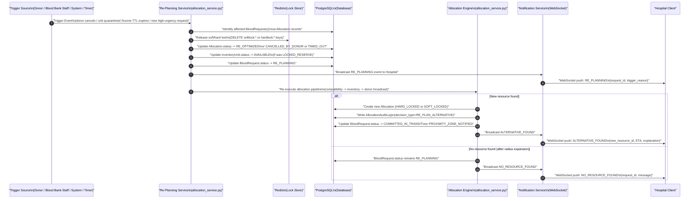

# System Workflow
# SmartBlood — Smart Blood & Emergency Donor Network

**Version:** 1.0  
**Stack Reference:** Stack.md  
**Architecture Reference:** Architecture.md  
**PRD Reference:** PRD.md

> All workflow descriptions use **synthetic data** for examples. No real patient, donor, hospital, or blood-bank data is used.

---

## 1. Overall Workflow

```mermaid
flowchart TD
    A["User / Event\n(Hospital, Blood Bank, Donor, Admin, System)"]
    B["Emergency Request Created\nor State-Change Event Received"]
    C{"Request Valid?\n(blood group, component, quantity,\ntriage level, deadline in future)"}
    D["HTTP 422 Validation Error\nReturned to Caller"]
    E["Urgency Score Computed\n(triage_level + time_remaining -> 0-100)"]
    F["Request Status: PENDING_EVALUATION\nAllocation Pipeline Triggered"]
    G["Compatibility Filter\n(ABO/Rh matrix lookup;\ncomponent type determines\nRBC or plasma path)"]
    H["Availability Filter\n(AVAILABLE + not expired;\nis_available + is_verified)"]
    I["Quantity Feasibility Check\n(available_units >= units_requested)"]
    J["Verification Filter\n(is_verified = true;\nno stale flag)"]
    K["Proximity Filter\n(ST_DWithin <= search_radius_km)"]
    L["Feasible Candidate Pool\n(blood units or donors)"]
    M{"Inventory\nCandidates\nFound?"}
    N["FEFO Ordering\n(earliest expiry first)\nProximity Score Computed"]
    O["Proximity Donor\nBroadcast\n(soft locks on all zone donors;\nnotification sent)"]
    P["Allocation Recommendation Generated\n(HARD_LOCKED inventory unit\nor SOFT_LOCKED donor zone)"]
    Q["Explanation Generated\n(candidate_scores_json + rationale_summary\nwritten to AllocationAuditLog)"]
    R["Authorization / Reservation\n(Inventory: Redis soft lock -> hard lock in pipeline;\nDonor: First-Ack Redis SET NX)"]
    S["Notification Dispatched\n(WebSocket push to hospital, donor, blood bank)"]
    T["Monitoring\n(Request status tracked;\nlock TTLs watched;\nre-planning trigger listening)"]
    U{"State-Change\nEvent?"}
    V["Re-planning Pipeline\n(release lock -> RE_PLANNING ->\nre-execute from Step G)"]

    A --> B
    B --> C
    C -- Invalid --> D
    C -- Valid --> E
    E --> F
    F --> G
    G --> H
    H --> I
    I --> J
    J --> K
    K --> L
    L --> M
    M -- Yes --> N
    M -- No --> O
    N --> P
    O --> P
    P --> Q
    Q --> R
    R --> S
    S --> T
    T --> U
    U -- Yes --> V
    V --> G
    U -- No --> T
```



---

## 2. Emergency Request Workflow

### Step-by-Step Description

**Step 1: User Creates Request**  
A hospital user (role: HOSPITAL_ADMIN) submits an emergency blood request via the Hospital Dashboard (Emergency Request Intake Screen).  
Required fields: `required_blood_group`, `component_type`, `units_requested` (>= 1), `triage_level`, `deadline_at` (must be in the future), `patient_id_token` (opaque hospital-supplied identifier).

**Step 2: System Validates Required Information**  
Pydantic v2 schema validates the request body at the API layer before any service logic runs. Validation failures return HTTP 422 with field-level error details.  
Additional business validation: `deadline_at > now()`.

**Step 3: Request Receives Status**  
On successful validation:
- `calculated_urgency_score` is computed using `MatchingEngineService.calculate_urgency_score(triage_level, deadline_at)`.
- A `BloodRequest` record is created with status `PENDING_EVALUATION`.
- An `AllocationAuditLog` entry is written for request creation.

**Step 4: Relevant Resources Are Discovered**  
The allocation pipeline begins:
1. `MatchingEngineService.get_compatible_donor_types(required_blood_group, is_plasma)` returns the list of compatible blood groups.
2. `InventoryRepository.find_compatible_units_with_lock(compatible_groups, component_type, limit)` queries PostgreSQL for available, non-expired, compatible units ordered by `expiry_date ASC` (FEFO).
3. If insufficient inventory: `DonorRepository.find_eligible_donors_in_proximity(compatible_groups, hospital_lat, hospital_lng, radius_km)` queries donors using `ST_DWithin`.

**Step 5: Compatibility Is Evaluated**  
The compatibility filter is the first gate — all candidates must pass the ABO/Rh matrix check before proceeding to availability or scoring steps.

**Step 6: Feasibility Is Calculated**  
- For inventory: quantity feasibility checked (`found_units >= units_requested`).
- For donors: proximity score computed per donor using `compute_proximity_score(distance_km)`.

**Step 7: Candidate Resources Are Evaluated**  
- Inventory path: FEFO ordering (earliest expiry first); proximity score as secondary factor.
- Donor path: PostGIS distance ordering as primary; reliability_score as secondary.

**Step 8: Recommendation Is Generated**  
- Inventory match: `Allocation` record created with `source_type=BLOOD_BANK_INVENTORY`, `status=HARD_LOCKED`. `InventoryUnit.status` -> `LOCKED_RESERVE`.
- Donor match: Soft locks placed on all zone donors. Dispatch notifications sent. Request status -> `PROXIMITY_ZONE_NOTIFIED`. First accepting donor triggers atomic hard lock (Redis SET NX); `Allocation.status` -> `HARD_LOCKED`.

**Step 9: Authorized User Confirms / Reserves**  
- Inventory path: The allocation is confirmed immediately by the engine (no explicit user action required for soft-to-hard transition — it happens in the pipeline). The hospital sees status `COMMITTED_IN_TRANSIT`.
- Donor path: The donor's ACCEPT response serves as the first-ack confirmation. The Redis atomic SET NX acts as the concurrency guard.

**Step 10: Stakeholders Receive Updates**  
WebSocket push events sent to:
- Hospital: allocation matched / committed in transit / re-planning / fulfilled.
- Zone donors: dispatch alert / stand-down.
- Blood bank: inventory lock placed.
- Coordinator: system-wide event feed.

---

## 3. Blood Bank Inventory Workflow

### Adding Blood Units
1. Blood bank staff logs in (role: `BLOOD_BANK_STAFF`).
2. POST `/api/v1/inventory/units` with `blood_group`, `component_type`, `volume_ml`, `batch_number`, `collection_date`, `expiry_date`.
3. System validates: `batch_number` must be unique; `expiry_date > collection_date`; `expiry_date > now()`.
4. `InventoryUnit` created with `status = AVAILABLE`.
5. WebSocket event broadcast: `INVENTORY_UNIT_ADDED` to coordinators.
6. If any requests are in `RE_PLANNING` status for a compatible blood group and component type, the allocation engine re-evaluates those requests.

### Updating Availability
1. Blood bank staff selects a unit.
2. PATCH `/api/v1/inventory/units/{id}/status` with `new_status`.
3. If `new_status = QUARANTINED` or `EXPIRED`:
   - If unit was `LOCKED_RESERVE`: Redis soft lock is released; `lock_expires_at` cleared.
   - All requests holding soft locks on this unit are identified and set to `RE_PLANNING`.
   - Re-planning pipeline fires for affected requests.
   - Hospital(s) notified via WebSocket.

### Reserving Units
1. Allocation engine (internal): calls `acquire_soft_lock()` on target unit.
2. `InventoryUnit.status` -> `LOCKED_RESERVE`; `lock_expires_at` set.
3. If inventory allocation confirmed (hard lock): `status` stays `LOCKED_RESERVE` until dispatch.
4. Blood bank dashboard reflects the lock status in real time via WebSocket.

### Releasing Units
1. Triggered by: request cancellation, lock TTL expiry, re-planning.
2. `InventoryUnit.status` -> `AVAILABLE`; `lock_expires_at` cleared.
3. WebSocket event: `INVENTORY_UNIT_RELEASED` to blood bank.

### Marking Units Unavailable
1. Blood bank staff marks unit as `QUARANTINED`, `EXPIRED`, or `DISPATCHED` manually.
2. System response: see "Updating Availability" above.

### Triggering Re-planning
- Any status change to `QUARANTINED` or `EXPIRED` on a unit that was `AVAILABLE` or `LOCKED_RESERVE` triggers the re-planning pipeline for affected requests.

---

## 4. Donor Workflow

### Registration
1. User registers with role `DONOR` via POST `/api/v1/auth/register`.
2. Donor profile created with: `blood_group`, `date_of_birth`, `weight_kg`, optional `last_donation_date`.
3. `is_available = true` by default; `is_verified = false` initially.
4. Location fields (`latitude`, `longitude`, `location`) are null until the donor updates their position.

### Verification
1. A `SYSTEM_ADMIN` reviews the donor registration.
2. Admin sets `is_verified = true` via the admin API.
3. Until verified, the donor is excluded from proximity broadcast queries.

> **Important:** The system does not perform clinical medical eligibility assessment. Donor eligibility (e.g., compliance with minimum donation intervals) is tracked via the `last_donation_date` field and evaluated against a configured minimum interval. This evaluation supports coordinator decision-making and does not constitute a medical determination.

### Availability
1. Donor opens the Donor Dashboard.
2. Donor toggles PATCH `/api/v1/donors/availability` with `{ "is_available": true/false, "latitude": ..., "longitude": ... }`.
3. System updates `donor.is_available`, `donor.latitude`, `donor.longitude`, and PostGIS `donor.location` geometry.
4. If `is_available = true` and matching requests in `RE_PLANNING` exist: re-planning pipeline is re-triggered.

### Matching
1. Allocation engine calls `DonorRepository.find_eligible_donors_in_proximity()`.
2. Query filters: `blood_group IN (compatible_groups) AND is_available = true AND is_verified = true AND ST_DWithin(location, hospital_location, radius_meters)`.
3. Results ordered by `ST_Distance(location, hospital_location) ASC`.
4. Proximity score computed per donor.

### Contact / Response
1. All matched donors in the proximity zone simultaneously receive a WebSocket dispatch notification.
2. Notification includes: hospital name, component requested, estimated distance, response TTL countdown (e.g., 180 seconds).

### Acceptance
1. Donor taps ACCEPT: POST `/api/v1/donors/requests/{request_id}/respond` with `{ "action": "ACCEPT" }`.
2. Service calls `ConcurrencyLockManager.acquire_hard_lock(request_id, donor_id)` (Redis SET NX).
3. If acquired: `Allocation.status` -> `HARD_LOCKED`; `BloodRequest.status` -> `COMMITTED_IN_TRANSIT`; hospital receives confirmation; all other zone donors receive stand-down notification.
4. If not acquired (another donor already claimed): HTTP 409 returned to this donor; donor sees "Request already fulfilled by another donor nearby."

### Rejection
1. Donor taps DECLINE: POST `/api/v1/donors/requests/{request_id}/respond` with `{ "action": "DECLINE" }`.
2. Service calls `release_soft_locks_for_zone()` for this donor only.
3. The declined donor is not re-notified for the same request in the current allocation cycle.
4. If all zone donors decline, re-planning fires (radius expansion or alternative search).

### Temporary Unavailability
1. Donor sets `is_available = false`.
2. Any pending soft locks for this donor are released.
3. The donor is removed from future proximity queries until they set `is_available = true` again.

### Re-planning After Donor Unavailability
1. Trigger: donor cancels in-transit OR soft lock expires OR donor declines.
2. Re-planning pipeline fires for the affected request.
3. Engine attempts next-best donor or falls back to inventory.

---

## 5. Multiple Patient Competition Workflow

### Synthetic Scenario

**Patient A (Synthetic):**
- Hospital: City Central Hospital (Synthetic, located at 12.9716° N, 77.5946° E)
- Blood requirement: O− PRBC
- Quantity: 2 units
- Urgency: `MASSIVE_TRANSFUSION_PROTOCOL` (base score: 95)
- Deadline: 15 minutes from now → time modifier: +20 → final urgency score: **min(100, 115) = 100**
- Location: City Central Hospital

**Patient B (Synthetic):**
- Hospital: North General Hospital (Synthetic, located at 13.0100° N, 77.5800° E)
- Blood requirement: O− PRBC (same blood group — competing for same resource)
- Quantity: 1 unit
- Urgency: `ACTIVE_TRAUMA` (base score: 80)
- Deadline: 45 minutes from now → time modifier: +10 → final urgency score: **min(100, 90) = 90**
- Location: North General Hospital

**Available Resource (Synthetic):**
- Blood Bank: Metro Blood Services (Synthetic, located at 12.9800° N, 77.5950° E)
- Available O− PRBC units: 2 (batch BB-001, expiry 2026-12-15; batch BB-002, expiry 2027-01-10)
- Distance to City Central Hospital: 0.9 km → proximity_score: 0.94
- Distance to North General Hospital: 4.2 km → proximity_score: 0.72

**Allocation Engine Evaluation:**

```
Active Requests (sorted by urgency score DESC):
  1. Request A: urgency_score = 100, requires 2 units O- PRBC
  2. Request B: urgency_score = 90,  requires 1 unit O- PRBC

Available O- PRBC inventory: 2 units (BB-001, BB-002)

--- Evaluate Request A (urgency 100, 2 units) ---
Compatibility: O- compatible donors: [O-] -> BB-001 (O-) and BB-002 (O-) PASS
Availability: AVAILABLE, not expired -> PASS
Quantity feasibility: 2 available >= 2 requested -> PASS
FEFO order: BB-001 (expiry 2026-12-15) selected first, BB-002 second
Proximity: distance = 0.9 km -> proximity_score = 0.94
Allocation: Reserve BB-001 and BB-002 -> LOCKED_RESERVE
AllocationAuditLog: decision_type=INVENTORY_MATCH, urgency_score=100,
  rationale_summary="2 O- PRBC units reserved (FEFO: BB-001, BB-002).
   Proximity score: 0.94 (0.9km from hospital). Urgency: 100/100."
Request A status: COMMITTED_IN_TRANSIT
Hospital A notified: ALLOCATION_MATCHED

--- Evaluate Request B (urgency 90, 1 unit) ---
Compatibility: [O-] -> PASS (by blood group)
Availability: BB-001 LOCKED_RESERVE (by Request A), BB-002 LOCKED_RESERVE (by Request A)
  -> 0 available O- PRBC units remain
Quantity feasibility: 0 available < 1 requested -> INVENTORY DEPLETED
-> Fallback to DONOR PROXIMITY BROADCAST
Proximity zone query: Donors with blood_group = O-, is_available = true,
   is_verified = true, within 5 km of North General Hospital
-> [No synthetic donors found in initial 5km zone]
-> Radius expansion: 10 km
-> [No synthetic donors found in 10km zone]
-> Request B status: RE_PLANNING
Hospital B notified: NO_COMPATIBLE_RESOURCE_FOUND, RE_PLANNING
```

**Key Point:** Request B is **not** served from the same inventory because those units are locked to Request A. The engine does not blindly give all resources to the highest-urgency request if lower-priority requests can be served by separate resources. In this scenario, no separate resources exist for O− PRBC, so Request B waits in `RE_PLANNING`.

**Coordinator View:** The live queue shows both requests. Request A is COMMITTED_IN_TRANSIT. Request B is RE_PLANNING with explanation: "Inventory depleted by Request A (higher urgency). No eligible donors in 10km radius. Awaiting new resources."

---

## 6. Resource Unavailability Workflow

```
Initial State:
  Request R (ACTIVE_TRAUMA, A+, 1 unit PRBC) -> allocated to Unit U1 (LOCKED_RESERVE)
  
  Step 1: Blood bank staff discovers Unit U1 is contaminated.
  Step 2: Staff updates status: PATCH /api/v1/inventory/units/{U1.id}/status
          { "new_status": "QUARANTINED" }
  
  Step 3: System detects lock conflict:
          - U1 was LOCKED_RESERVE for Request R
          - Redis soft lock for U1:Request R released
          - U1.status -> QUARANTINED; U1.lock_expires_at cleared
  
  Step 4: Allocation for Request R set to RE_OPTIMIZED
  
  Step 5: Request R.status -> RE_PLANNING
  
  Step 6: WebSocket notification -> Hospital:
          { "event_type": "RE_PLANNING",
            "request_id": "R",
            "reason": "Preferred resource QUARANTINED",
            "previous_unit": "U1" }
  
  Step 7: Re-planning pipeline re-executes from Step 1:
          - Compatible groups for A+: [O-, O+, A-, A+]
          - Query inventory: next available A+/A-/O-/O+ PRBC unit
          - Found: Unit U2 (A+, AVAILABLE, expiry 2027-02-20)
          - Distance: 1.4 km -> proximity_score: 0.91
          - Reserve U2: LOCKED_RESERVE
  
  Step 8: New Allocation created (status=HARD_LOCKED, unit=U2)
  
  Step 9: AllocationAuditLog:
          decision_type = RE_PLAN_ALTERNATIVE
          rationale_summary = "Unit U1 quarantined. Alternative: Unit U2 (A+, FEFO, 1.4km). Urgency: 80."
  
  Step 10: Hospital notified:
           { "event_type": "ALTERNATIVE_FOUND",
             "request_id": "R",
             "new_unit_id": "U2",
             "estimated_transit_minutes": 8,
             "explanation": "Unit U1 quarantined. Unit U2 selected: compatible A+, nearest available, expiry 2027-02-20." }
  
  Step 11: Request R.status -> COMMITTED_IN_TRANSIT
```

---

## 7. New Emergency Workflow

**Scenario:** A higher-urgency request arrives while resources are allocated.

```
Initial State:
  Request X (SCHEDULED_EMERGENCY_RESERVE, O+, 1 unit PRBC, urgency_score=55)
  -> Allocated to Unit U3 (O+, LOCKED_RESERVE)

  New Event:
  Request Y (MASSIVE_TRANSFUSION_PROTOCOL, O-, 2 units PRBC, urgency_score=100)
  arrives.

Engine Response:

  Step 1: Request Y created, urgency_score = 100, status = PENDING_EVALUATION.
  
  Step 2: Allocation pipeline executes for Request Y.
  
  Step 3: Compatible groups for O-: [O-]
          Available O- PRBC inventory queried.
  
  Step 4: Unit U3 is O+, not O-. Not compatible with Request Y (O- requires O- only).
          -> U3 is not considered for Request Y.
  
  Step 5: No O- PRBC units available in inventory.
          -> Donor proximity broadcast initiated for Request Y.
  
  Step 6: Donor D1 (O-, is_available=true, is_verified=true, 2.1 km from hospital Y)
          found in proximity zone.
          Soft lock placed on D1.
          Dispatch notification sent to D1.
  
  Step 7: D1 accepts. Hard lock claimed.
          Request Y -> COMMITTED_IN_TRANSIT.
          Hospital Y notified.

Note on Request X:
  Request X retains its allocation on U3. U3 is O+ (different blood group).
  There is no reason to revoke X's allocation for Y (they require different blood groups).
  X continues in COMMITTED_IN_TRANSIT status.

IMPORTANT: The system does NOT automatically revoke a confirmed HARD_LOCKED
allocation merely because a higher-urgency request arrives,
UNLESS the resources are actually competing (same unit, same donor).
In this scenario, they are not competing — different blood groups.
```

**Scenario with actual resource conflict:**

```
If Request Y required O+ (same as U3 which X holds):
  - U3 is LOCKED_RESERVE with a soft lock for X (not yet HARD_LOCKED).
  - Request Y has urgency_score 100 vs. X's urgency_score 55.
  - The engine recognises U3 is soft-locked but not yet hard-locked.
  - Implementation Decision: In the current prototype implementation,
    soft-locked resources are treated as unavailable to prevent over-allocation.
    The engine proceeds to donor broadcast for Y.
    A SYSTEM_ADMIN may manually override and reassign U3 to Y if clinically justified.
  - The system does NOT automatically revoke X's soft lock for Y without coordinator action.
```

---

## 8. Transportation Workflow

### Estimated Travel Time Computation
1. When a donor or blood unit is matched to a request, the allocation engine computes:
   - `distance_km` = `ST_Distance(resource_location, hospital_location)` / 1000
   - `estimated_transit_minutes` = `(distance_km / assumed_speed_kmh) * 60`
   - `assumed_speed_kmh` is configurable (Implementation Decision; default value in `core/config.py`)
2. Both values are stored on the `Allocation` record.
3. The `rationale_summary` in `AllocationAuditLog` includes distance and estimated transit time.
4. The hospital's Live Tracking screen displays `estimated_transit_minutes`.

### Transportation Constraint (Delay Update)
1. A donor in transit encounters a delay or vehicle failure.
2. Donor sends a cancellation signal: POST `/api/v1/donors/requests/{request_id}/respond` with `{ "action": "CANCEL_IN_TRANSIT" }`.
3. The hard lock is released: `Allocation.status` -> `CANCELLED_BY_DONOR`.
4. `BloodRequest.status` -> `RE_PLANNING`.
5. Hospital notified: "Donor transport failed. Re-planning for alternative resource."
6. Re-planning pipeline fires (see Section 11).

### Mock Travel-Time Provider
For the prototype, travel time is estimated using straight-line PostGIS distance and an assumed average speed. This is explicitly a mock. A real routing provider (e.g., OSRM, Google Maps Distance Matrix) can replace this calculation by implementing the same interface:
```python
def estimate_transit(source_lat, source_lng, dest_lat, dest_lng) -> (distance_km, transit_minutes):
    ...
```

---

## 9. Verification Workflow

```
Step 1: Registration / Data Submission
  - New user registers via POST /api/v1/auth/register with role=DONOR,
    HOSPITAL_ADMIN, or BLOOD_BANK_STAFF.
  - User.is_verified defaults to FALSE.
  - Donor, Hospital, or BloodBank profile created as UNVERIFIED.

Step 2: Verification
  - SYSTEM_ADMIN reviews registration via Coordinator Dashboard.
  - Admin calls: PATCH /api/v1/admin/users/{id}/verify (or equivalent admin endpoint).
  - User.is_verified -> TRUE.
  - AllocationAuditLog entry written: "User {id} verified by admin {admin_id}."

Step 3: Verified / Unverified State
  - VERIFIED: donor included in proximity broadcasts;
              hospital can create requests;
              blood bank can register inventory.
  - UNVERIFIED: donor excluded from proximity queries;
                hospital requests rejected with HTTP 403;
                blood bank inventory registration rejected with HTTP 403.

Step 4: Availability Validity
  - Verified donors with is_available = true and a non-null location
    enter the candidate pool.
  - Donors with stale availability (last_availability_updated > configured_staleness_threshold)
    may be deprioritised (Implementation Decision).

Step 5: Eligibility / Status Checks in Allocation
  - During STEP 3 of the allocation pipeline (Donor Proximity Query):
    WHERE is_verified = true AND is_available = true
  - Unverified donors never appear in the candidate pool regardless of blood group or proximity.
```

---

## 10. Notification Workflow

### Notification Event Definitions

| Event Type | Trigger | Recipients | Payload |
|:-----------|:--------|:-----------|:--------|
| `REQUEST_CREATED` | New BloodRequest created | SYSTEM_ADMIN / Coordinators | request_id, hospital_name, blood_group, urgency_score |
| `ALLOCATION_MATCHED` | Inventory hard-locked | Hospital (requester), Blood Bank | request_id, unit_id, estimated_transit_minutes |
| `PROXIMITY_ZONE_NOTIFIED` | Donor broadcast initiated | All donors in zone | request_id, hospital_name, component_type, distance_km, response_ttl_seconds |
| `HARD_LOCK_CLAIMED` | First-ack donor accepts | Hospital (ETA confirmed), all other zone donors (stand-down) | request_id, donor_id (masked), estimated_transit_minutes |
| `DONOR_DECLINED` | Donor taps DECLINE | System (internal log only, unless all donors decline) | request_id, donor_id |
| `ZONE_TIMEOUT_NO_RESPONSE` | Proximity TTL expires with 0 accepts | Hospital | request_id, previous_radius_km, expanding_to_km |
| `RESOURCE_UNAVAILABLE` | Unit quarantined/expired mid-allocation | Hospital | request_id, unit_id, reason |
| `RE_PLANNING` | Re-plan triggered | Hospital | request_id, trigger_reason |
| `ALTERNATIVE_FOUND` | Re-plan succeeds with new resource | Hospital | request_id, new_resource_id, estimated_transit_minutes, explanation |
| `NO_RESOURCE_FOUND` | Re-plan fails (no candidates after radius expansion) | Hospital | request_id, message |
| `REQUEST_FULFILLED` | Allocation completed | Hospital | request_id, allocation_id |
| `REQUEST_CANCELLED` | Hospital cancels request | All soft-locked donors (stand-down), Blood Bank (lock released) | request_id |

### Delivery Mechanism
All notifications are delivered via the FastAPI WebSocket `ConnectionManager`. A connected client receives notifications as JSON messages over their WebSocket connection. Disconnected clients miss events (no replay in prototype).

---

## 11. Re-Planning Workflow



### Re-Planning Trigger Event Summary

| Trigger | Source | Affected Entity |
|:--------|:-------|:----------------|
| Donor cancels in transit | Donor (POST respond action=CANCEL_IN_TRANSIT) | BloodRequest via Allocation |
| Donor zone TTL expires (no accepts) | System timer / watchdog | BloodRequest in PROXIMITY_ZONE_NOTIFIED |
| All zone donors decline | Donor service (all soft locks released) | BloodRequest |
| InventoryUnit quarantined or expired | Blood bank staff (PATCH status) | BloodRequest with soft lock on unit |
| New inventory unit added | Blood bank staff (POST unit) | BloodRequests in RE_PLANNING for compatible group |
| Donor availability turns on | Donor (PATCH availability is_available=true) | BloodRequests in RE_PLANNING for compatible group |
| Hospital cancels request | Hospital (PATCH cancel) | All allocations for that request (lock release) |
| SYSTEM_ADMIN override | Coordinator (POST admin override) | Specified allocation |

---

## 12. Explainability Workflow

```
Input: BloodRequest R has been allocated to Resource X

Allocation Pipeline Records:
  1. compatibility_result:
       required_blood_group = "A+"
       is_plasma = false
       compatible_groups = ["O-", "O+", "A-", "A+"]
       selected_unit.blood_group = "A+" -> COMPATIBLE

  2. quantity_result:
       units_requested = 2
       units_found = 3
       quantity_feasible = true

  3. urgency_factor:
       triage_level = "ACTIVE_TRAUMA"
       base_score = 80
       minutes_remaining = 38
       time_modifier = +10
       calculated_urgency_score = 90

  4. accessibility_factor:
       blood_bank_location = (12.9800, 77.5950)
       hospital_location = (12.9716, 77.5946)
       distance_km = 0.94
       max_radius_km = 5.0
       proximity_score = 1 - (0.94 / 5.0) = 0.81
       estimated_transit_minutes = (0.94 / 30) * 60 = 1.9 minutes

  5. fefo_factor:
       selected_unit.batch_number = "BB-001"
       selected_unit.expiry_date = "2026-12-15"
       ordering = earliest expiry first (FEFO applied)

  6. scarcity_factor:
       total_compatible_available = 3 units
       competing_requests_for_same_group = 1 (only Request R)
       scarcity_level = LOW

  7. verification_factor:
       hospital.is_verified = true
       blood_bank.is_verified = true
       -> No verification penalty applied

  8. final candidate evaluation:
       Unit BB-001 scored highest (FEFO + proximity_score 0.81)
       Unit BB-002 scored second (later expiry)

  9. explanation object (AllocationAuditLog):
       decision_type    = "INVENTORY_MATCH"
       urgency_score    = 90.0
       selected_resource_id = "unit-bb-001-uuid"
       candidate_scores_json = {
           "BB-001": {"compatibility": "PASS", "quantity_feasible": true,
                      "proximity_score": 0.81, "expiry": "2026-12-15",
                      "fefo_rank": 1, "selected": true},
           "BB-002": {"compatibility": "PASS", "quantity_feasible": true,
                      "proximity_score": 0.81, "expiry": "2027-01-10",
                      "fefo_rank": 2, "selected": false}
       }
       rationale_summary = "2 A+ PRBC units reserved from Metro Blood Services
         (0.9km, ETA ~2 min). FEFO batch BB-001 selected (earliest expiry: 2026-12-15).
         Urgency score: 90/100 (ACTIVE_TRAUMA, 38 min to deadline).
         Proximity score: 0.81. No scarcity constraint."

GET /api/v1/audit/requests/{request_id}/explanation
-> Returns AllocationAuditLog JSON
```

**Rules for Explanation Content:**
- Only factors actually computed and used by the algorithm are included.
- Internal Redis key names, raw SQL queries, and implementation details are never exposed.
- Donor identifiers in explanations visible to hospitals are masked (donor_id only, not name/contact).

---

## 13. Failure Workflows

### F-01: No Compatible Resource Found
- **Detection:** After full compatibility + availability filtering and radius expansion, candidate pool is empty.
- **System Response:** `BloodRequest.status` -> `RE_PLANNING`. `AllocationAuditLog` entry written with `decision_type="NO_CANDIDATES"`.
- **User-Visible Status:** Hospital receives `NO_RESOURCE_FOUND` WebSocket event. Request shows status `RE_PLANNING` with message: "No compatible resource found at this time. System will retry when new resources become available."
- **Re-planning Behaviour:** System watches for inventory additions and donor availability changes. On any such event for a compatible blood group, the pipeline re-executes for this request automatically.

### F-02: Insufficient Quantity
- **Detection:** Inventory query finds compatible units but count < `units_requested`.
- **System Response:** Engine falls back to donor proximity broadcast. If donors are also insufficient, proceeds to F-01.
- **User-Visible Status:** Transparent to hospital if donor fallback succeeds. If it fails, F-01 applies.
- **Re-planning Behaviour:** Same as F-01.

### F-03: All Donors Unavailable
- **Detection:** Proximity zone query returns empty result (no verified, available, compatible donors within max search radius).
- **System Response:** Same as F-01.
- **User-Visible Status:** Same as F-01.
- **Re-planning Behaviour:** Re-triggered when any donor in a compatible blood group toggles `is_available = true`.

### F-04: All Blood Units Unavailable
- **Detection:** Inventory query finds 0 compatible, available, non-expired units.
- **System Response:** Falls back to donor broadcast. If donors also unavailable: F-01 applies.
- **Re-planning Behaviour:** Re-triggered when blood bank adds a new compatible unit.

### F-05: Stale Inventory (Lock Expired)
- **Detection:** `InventoryUnit.lock_expires_at < NOW()` but `status = LOCKED_RESERVE`.
- **System Response:** Unit treated as effectively AVAILABLE in the next query. Status reset to AVAILABLE. Next availability query includes the unit.
- **User-Visible Status:** Transparent. The unit re-enters the candidate pool.

### F-06: Transportation Unavailable (Donor Cancels In Transit)
- **Detection:** Donor sends `action=CANCEL_IN_TRANSIT`.
- **System Response:** Hard lock released. `Allocation.status` -> `CANCELLED_BY_DONOR`. `BloodRequest.status` -> `RE_PLANNING`. Re-planning pipeline fires.
- **User-Visible Status:** Hospital notified: "Donor transport cancelled. Re-planning for alternative resource."
- **Re-planning Behaviour:** Engine expands search radius or falls back to inventory.

### F-07: Notification (WebSocket) Failure
- **Detection:** asyncio exception when pushing to a disconnected WebSocket connection.
- **System Response:** Exception is caught and logged at ERROR level. The underlying allocation transaction is unaffected.
- **User-Visible Status:** Client misses the push event. On reconnect, the client can poll `GET /api/v1/requests/{id}` to get the current state.
- **Re-planning Behaviour:** Not applicable.

### F-08: Concurrent Allocation Conflict (Race Condition)
- **Detection:** Second donor's `acquire_hard_lock()` returns False (Redis SET NX fails because key already exists).
- **System Response:** `AllocationRaceConditionError` raised. HTTP 409 returned to the second donor.
- **User-Visible Status:** Second donor sees: "This request has already been claimed by another nearby donor."
- **Re-planning Behaviour:** Not applicable. The first donor remains hard-locked.

---

## 14. End-to-End Demo Workflow

This demo uses **entirely synthetic data** and demonstrates the core value proposition: dynamic multi-factor allocation, competing requests, re-planning, and explainability.

### Synthetic Actors
- **Synthetic Hospital A:** "City Central Hospital" — 12.9716° N, 77.5946° E
- **Synthetic Hospital B:** "North General Hospital" — 13.0100° N, 77.5800° E
- **Synthetic Blood Bank:** "Metro Blood Services" — 12.9800° N, 77.5950° E
  - Inventory: 2 units O− PRBC (BB-001 expiry 2026-12-15, BB-002 expiry 2027-01-10)
- **Synthetic Donor D1:** Blood group O−, is_available=true, is_verified=true, 2.1 km from City Central Hospital
- **Synthetic Donor D2:** Blood group O−, is_available=true, is_verified=true, 3.8 km from City Central Hospital

---

### Demo Step 1: Multiple Emergency Requests Exist

```
Action: Hospital A submits Request RA:
  blood_group=O-, component=PRBC, units=2,
  triage=MASSIVE_TRANSFUSION_PROTOCOL, deadline=now+12min
  -> urgency_score = min(100, 95+20) = 100

Action: Hospital B submits Request RB:
  blood_group=O-, component=PRBC, units=1,
  triage=ACTIVE_TRAUMA, deadline=now+50min
  -> urgency_score = min(100, 80+10) = 90

State:
  Active requests: [RA (urgency=100), RB (urgency=90)]
  Available O- PRBC inventory: BB-001, BB-002 (2 units total)
```

### Demo Step 2: Compatible Resources Are Limited

```
Engine evaluates RA first (highest urgency):
  Compatible groups: [O-]
  Inventory: BB-001 (O-, AVAILABLE), BB-002 (O-, AVAILABLE)
  Quantity: 2 available >= 2 requested -> FEASIBLE
  FEFO: BB-001 selected first (earlier expiry)
  Proximity: 0.9 km -> proximity_score 0.82
  Reserve: BB-001 -> LOCKED_RESERVE, BB-002 -> LOCKED_RESERVE
  Allocation created: source=BLOOD_BANK_INVENTORY, status=HARD_LOCKED
  Request RA: COMMITTED_IN_TRANSIT
  Hospital A notified: ALLOCATION_MATCHED, ETA ~2 min

Engine evaluates RB (urgency=90):
  Compatible groups: [O-]
  Inventory: BB-001 LOCKED (by RA), BB-002 LOCKED (by RA)
  0 available O- units remain -> Inventory depleted
  -> Donor broadcast
  Proximity query: D1 (2.1 km), D2 (3.8 km) found within 5 km
  Soft locks placed on D1 and D2
  Dispatch notification sent to D1 and D2 simultaneously
  Request RB: PROXIMITY_ZONE_NOTIFIED
```

### Demo Step 3: System Evaluates Competing Requirements

```
Allocation Engine Explanation for RA:
  "2 O- PRBC units reserved from Metro Blood Services.
   FEFO batch BB-001 (exp 2026-12-15) + BB-002 (exp 2027-01-10).
   Urgency: 100/100 (MTP, 12 min to deadline).
   Proximity: 0.82 (0.9 km). No competing claims on these units."

Allocation Engine Explanation for RB:
  "Inventory depleted by higher-urgency Request RA.
   Donor proximity broadcast initiated: D1 (2.1 km), D2 (3.8 km)
   within 5 km zone. Awaiting first acceptance (TTL: 180s).
   Urgency: 90/100."
```

### Demo Step 4: Recommendation Generated

```
RA: Recommendation = BB-001 + BB-002 (hard-locked)
RB: Recommendation = First-ack donor from {D1, D2} (soft-locked, pending response)
```

### Demo Step 5: System Explains the Recommendation

```
GET /api/v1/audit/requests/{RA.id}/explanation
Response:
{
  "decision_type": "INVENTORY_MATCH",
  "urgency_score": 100.0,
  "selected_resource_id": "unit-bb-001-uuid",
  "candidate_scores_json": {
    "BB-001": {"compatibility": "PASS", "proximity_score": 0.82,
               "expiry": "2026-12-15", "fefo_rank": 1, "selected": true},
    "BB-002": {"compatibility": "PASS", "proximity_score": 0.82,
               "expiry": "2027-01-10", "fefo_rank": 2, "selected": true}
  },
  "rationale_summary": "2 O- PRBC units reserved from Metro Blood Services
    (0.9km, ETA ~2min). FEFO: BB-001 + BB-002. Urgency 100/100."
}
```

### Demo Step 6: A Resource Becomes Unavailable

```
Event: Blood bank staff marks BB-001 as QUARANTINED.
  PATCH /api/v1/inventory/units/{BB-001.id}/status  { "new_status": "QUARANTINED" }
```

### Demo Step 7: System Detects the Change

```
System detects: BB-001 was LOCKED_RESERVE for RA.
  Redis soft lock for BB-001:RA released.
  BB-001.status -> QUARANTINED.
  RA's allocation for BB-001 -> RE_OPTIMIZED.
  RA.status -> RE_PLANNING.
  Hospital A notified: RE_PLANNING (reason: unit BB-001 quarantined).
```

### Demo Step 8: System Searches Alternatives

```
Re-planning pipeline for RA:
  Compatible groups: [O-]
  BB-001: QUARANTINED -> excluded.
  BB-002: LOCKED_RESERVE (still held by RA for the second unit) -> still reserved.
  Only 1 unit available from inventory (BB-002, still locked for RA).
  RA requested 2 units. 1 unit locked (BB-002) + 1 unit missing.
  -> Donor broadcast for the missing 1 unit:
     D1 (2.1 km, O-) and D2 (3.8 km, O-) within 5km zone.
     (RB's soft locks on D1/D2 still active — but they are non-exclusive soft locks.)
     Engine places additional soft locks on D1/D2 for RA.
     Dispatch notifications sent: "New emergency request for 1 O- PRBC."
```

### Demo Step 9: Allocation Is Recalculated

```
D1 responds first for RA: POST /api/v1/donors/requests/{RA.id}/respond {action: ACCEPT}
  Redis SET NX: hardlock:request:RA -> D1_id  SUCCESS
  D1 -> HARD_LOCKED for RA (1 unit from donor).
  D2 receives stand-down for RA.

RA now has:
  - BB-002 (1 inventory unit, LOCKED_RESERVE) +
  - D1 (1 live donor, HARD_LOCKED)
  Total: 2 units sourced.
  RA.status -> COMMITTED_IN_TRANSIT.

AllocationAuditLog for RA (re-plan entry):
  decision_type = RE_PLAN_ALTERNATIVE
  rationale_summary = "Unit BB-001 quarantined. Alternative: Donor D1 (O-,
    2.1km, ETA ~4min) + retained BB-002. Urgency: 100/100."
```

### Demo Step 10: Users Receive the Updated Result

```
Hospital A WebSocket:
  { "event_type": "ALTERNATIVE_FOUND",
    "request_id": "RA",
    "resources": [
      {"type": "BLOOD_BANK_INVENTORY", "unit_id": "BB-002", "eta_minutes": 2},
      {"type": "LIVE_DONOR", "donor_masked_id": "D1-****", "eta_minutes": 4}
    ],
    "explanation": "Unit BB-001 quarantined. Hybrid allocation: BB-002 (inventory)
      + Donor D1 (2.1km). Total 2 O- PRBC units. Urgency 100/100." }

Coordinator Dashboard:
  Live queue updated.
  RA: COMMITTED_IN_TRANSIT (hybrid: inventory + donor).
  RB: PROXIMITY_ZONE_NOTIFIED (awaiting D1 or D2 — D2 still has soft lock for RB).
  D2 may still accept for RB (D2's soft lock for RB was not released by RA's re-plan).
```
