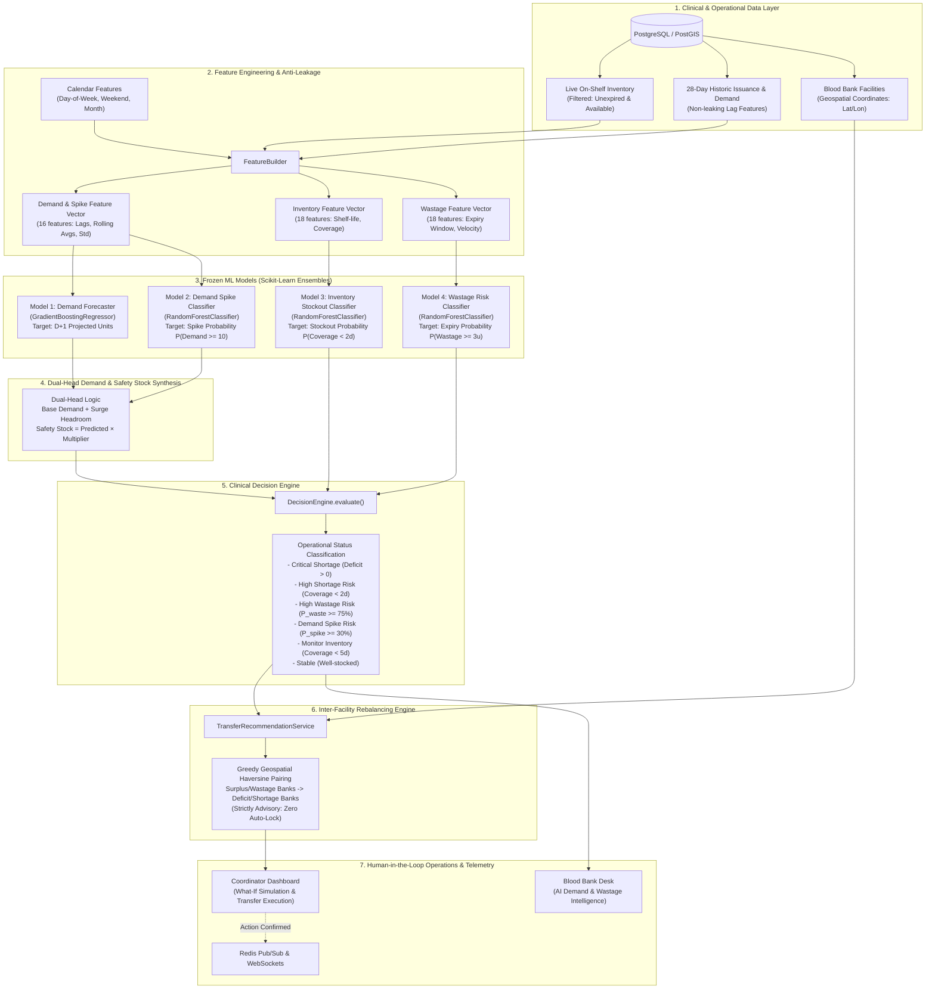
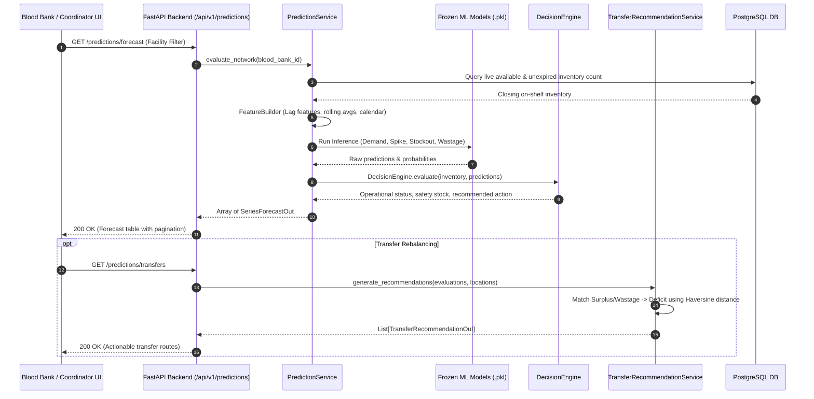

# SmartBlood ML Prediction & Operational Decision-Support Architecture

This document provides a comprehensive technical architecture map of the **SmartBlood Predictive Intelligence & Inter-Facility Network Rebalancing Platform**, including data pipelines, ML ensemble models, mathematical decision heuristics, Redis eviction/caching policies, and distributed event coordination.

---

## 1. System Architecture Overview



---

## 2. Machine Learning Model Pipeline

The predictive platform operates on **4 frozen scikit-learn models** trained on standardized clinical issuance histories.

| Model ID | Artifact Names | Algorithm | Target Metric / Output | Evaluation Purpose |
| :--- | :--- | :--- | :--- | :--- |
| **Model 1: Demand** | `demand_forecast_model.pkl`<br>`demand_forecast_preprocessor.pkl` | `GradientBoostingRegressor` | Continuous float ($\ge 0$ units) | Predicts next-day baseline consumption for blood component & group. |
| **Model 2: Spike Risk** | `spike_risk_model.pkl`<br>`spike_risk_preprocessor.pkl` | `RandomForestClassifier` | Probability $P(\text{Demand} \ge 10) \in [0, 1]$ | Identifies impending mass casualty / trauma surges. |
| **Model 3: Stockout Risk** | `inventory_risk_model.pkl`<br>`inventory_risk_preprocessor.pkl` | `RandomForestClassifier` | Probability $P(\text{Coverage} < 2\text{d}) \in [0, 1]$ | Predicts near-term inventory exhaustion. |
| **Model 4: Wastage Risk** | `wastage_risk_model.pkl`<br>`wastage_risk_preprocessor.pkl` | `RandomForestClassifier` | Probability $P(\text{Wastage} \ge 3\text{u}) \in [0, 1]$ | Flags inventory at risk of expiring on shelves before use. |

### Dual-Head Demand & Safety Stock Calculation
Standard regression alone often underpredicts rare surge events. SmartBlood uses a **dual-head synthesis**:
1. **Base Demand**: Predicted by Model 1 ($\hat{D}_{\text{base}}$).
2. **Surge Headroom**: If Model 2 yields $P_{\text{spike}} \ge 0.30$, the system computes:
   $$\hat{D}_{\text{effective}} = \max\left(\hat{D}_{\text{base}}, \text{Demand}_{\text{max, 7d}}, 10.0\right)$$
3. **Component-Specific Safety Multipliers**:
   - **Platelets** (5-day shelf life): $1.5 \times \text{Daily Demand}$
   - **PRBC** (42-day shelf life): $2.0 \times \text{Daily Demand}$
   - **FFP** (365-day shelf life): $2.5 \times \text{Daily Demand}$

---

## 3. AI Inter-Facility Network Rebalancing

### What It Does
The **Inter-Facility Network Rebalancing Engine** analyzes all blood banks across the metropolitan grid and algorithmically matches facilities experiencing **surplus units** or **high wastage/expiry risk** ($\ge 50\%$) with facilities experiencing **acute deficits** or **critical shortages**.

### Why It Exists (Clinical & Operational Rationale)
1. **Perishability Constraints**: Blood platelets expire in only **5 days**. If a regional blood bank has 15 bags of platelets and low forecasted consumption, those units would spoil and be incinerated.
2. **Geospatial Proximity**: Rather than dispatching live volunteer donors or running emergency drives, the algorithm routes cold-chain inventory between facilities, prioritizing shortest transit times calculated via the **Haversine Distance Formula**:
   $$d = 2R \arcsin\left(\sqrt{\sin^2\left(\frac{\Delta \phi}{2}\right) + \cos(\phi_1)\cos(\phi_2)\sin^2\left(\frac{\Delta \lambda}{2}\right)}\right)$$
3. **Safety & Zero-Lock Advisory**: Transfer recommendations are **strictly advisory**. The ML system **never** automatically reserves or moves physical units without human coordinator review and explicit confirmation.

---

## 4. Redis Eviction Policy & Concurrency Architecture

### Redis Role in SmartBlood
Redis operates as the **Distributed Lock Manager**, **Real-Time Event Bus (Pub/Sub)**, and **Fast Deduplication Cache**.

### Eviction Policy
In production and containerized deployments, SmartBlood configures Redis with:
```text
maxmemory 256mb
maxmemory-policy noeviction
```

#### Why `noeviction`?
1. **Safety-Critical Concurrency Locks**: SmartBlood uses atomic Redis keys (`lock:hard:req:{id}:unit:{slot}`) to guarantee that two blood banks or donors **never** claim the same unit slot concurrently. If Redis were configured with an LRU eviction policy (`allkeys-lru` or `volatile-lru`), a memory pressure spike could evict an active lock, leading to catastrophic **double-allocation** of emergency blood.
2. **Explicit Deterministic TTLs**: Every key created by SmartBlood manages its own lifecycle with deterministic Time-To-Live (`EX`):
   - **Hard Unit Claim Locks**: $TTL = 86,400\text{s}$ ($24\text{h}$, automatically dropped upon courier handover or hospital fulfillment).
   - **Alert Zone Timeout Keys**: $TTL = 180\text{s}$ (3-minute window before expanding notification geofence).
   - **Cache & Telemetry Keys**: Explicit $TTL = 60\text{s} - 300\text{s}$.
   - **Dead Letter Queue (DLQ)**: Monitored and bounded.

---

## 5. End-to-End Prediction Lifecycle Flow


