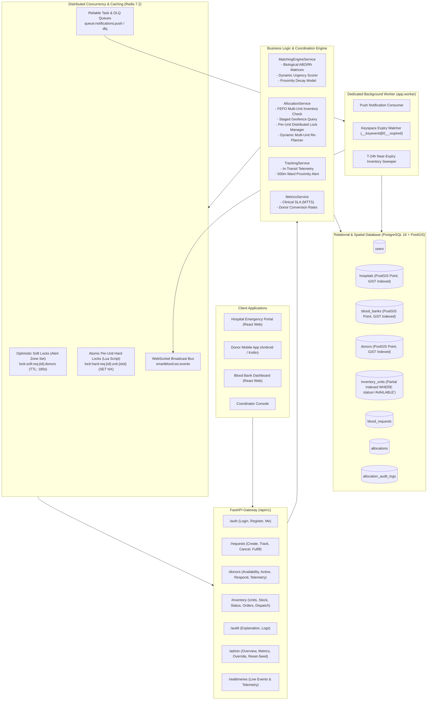
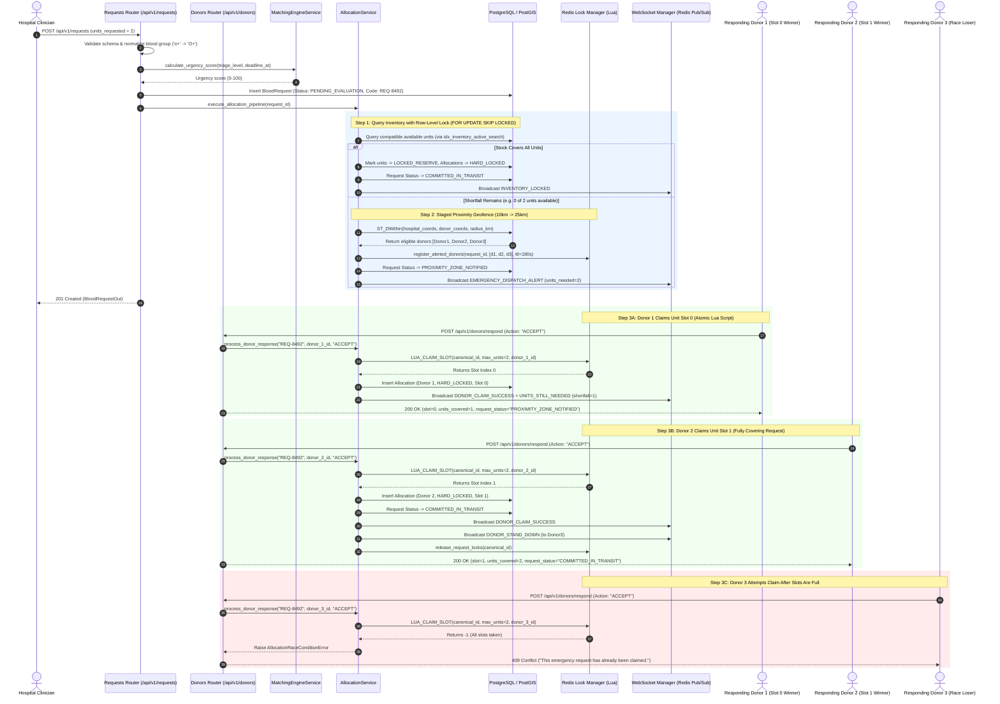
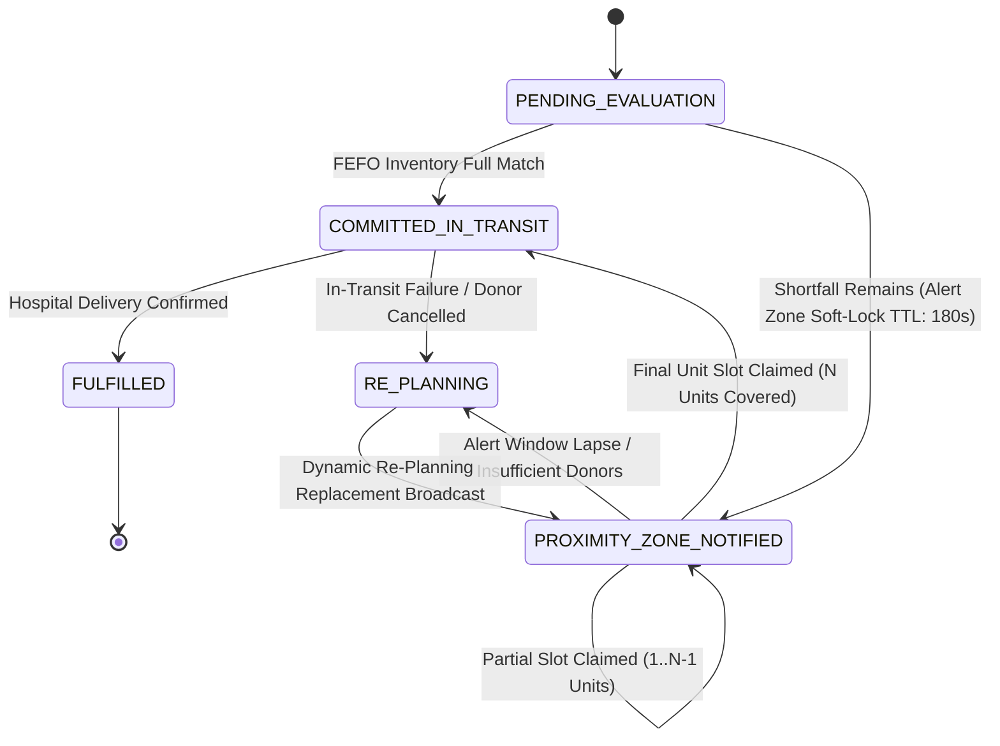

# SmartBlood (Yarin) — Backend Architecture & Workflow Specification

This document provides a comprehensive technical breakdown of the SmartBlood backend architecture, request processing lifecycles, concurrency controls, biological cross-matching rules, data models, route-by-route execution flows, and implemented enterprise architectural optimizations.

---

## 1. System Architecture Overview

SmartBlood is built with **FastAPI (Python 3.12/3.13)**, **PostgreSQL 16 + PostGIS 3.4**, **Redis 7.2**, **SQLAlchemy 2.0 (Async)**, and **WebSockets**. It solves dynamic emergency blood allocation using an elastic, multi-tier optimization pipeline:

1. **Tier 1 (Cold-Chain Inventory)**: Immediate First-Expired, First-Out (FEFO) reserve matching from nearby blood bank stocks with database row-level locking (`SELECT ... FOR UPDATE SKIP LOCKED`) and partial index acceleration.
2. **Tier 2 (Live Donor Proximity Geofencing & Multi-Unit Slot Claims)**: Multi-candidate parallel broadcast with distributed soft-lock alert zones and atomic per-unit slot claims via an atomic Redis Lua script (`LUA_CLAIM_SLOT`), enabling $N$ units to be secured by $N$ distinct donors concurrently without race conditions.
3. **Dynamic Re-Planning & Self-Healing**: Automated replenishment when stock fails inspection or when allocated donors drop out, monitored via Redis keyspace expiry events and a dedicated background worker daemon.



---

## 2. Core Request Processing Lifecycles

### 2.1 Multi-Unit Emergency Allocation & Concurrency Race Resolution



---

## 3. Route-by-Route Processing Breakdown

### 3.1 Authentication & Profile Management (`/api/v1/auth`)

*Protected by sliding-window rate limit: 60 requests / minute.*

| Endpoint | Method | Input Schema | Response Schema | Description & Processing Flow |
| :--- | :--- | :--- | :--- | :--- |
| `/api/v1/auth/register` | `POST` | `RegisterRequest` | `UserOut` | Normalizes email and role (`UserRole`); verifies uniqueness; hashes password with bcrypt; creates `User` and linked profile (`Hospital`, `Donor`, or `BloodBank`); returns `201 Created`. |
| `/api/v1/auth/login` | `POST` | `LoginRequest` | `Token` | Verifies credentials; issues JWT access token signed with `HS256` (`sub`, `role`, `exp`, `iat`); returns bearer token. |
| `/api/v1/auth/me` | `GET` | *(Bearer Token)* | `UserOut` | Returns active authenticated user record. |

---

### 3.2 Emergency Blood Requests (`/api/v1/requests`)

*Supports `Idempotency-Key` header to prevent duplicate creations over spotty connections.*

| Endpoint | Method | Input Schema | Response Schema | Description & Processing Flow |
| :--- | :--- | :--- | :--- | :--- |
| `/api/v1/requests` | `POST` | `BloodRequestCreate` | `BloodRequestOut` | Enforces role check (`HOSPITAL`, `COORDINATOR`, `ADMIN`); auto-generates short code (`REQ-8492`); computes urgency score; creates `BloodRequest`; triggers `AllocationService.execute_allocation_pipeline()`; returns `201 Created`. |
| `/api/v1/requests/{id}` | `GET` | `id: str` | `BloodRequestOut` | Retrieves real-time request state. Accepts either full UUID or short code (`REQ-8492`). |
| `/api/v1/requests` | `GET` | `skip: int, limit: int` | `List[BloodRequestOut]` | Lists active requests ordered by urgency score descending. Hospital users are restricted to their own facility. |
| `/api/v1/requests/{id}/cancel` | `PATCH` | `id: str` | `BloodRequestOut` | Cancels request (UUID or short code), releases all Redis locks, and resets reserved inventory to `AVAILABLE`. |
| `/api/v1/requests/{id}/fulfill` | `POST` | `id: str` | `BloodRequestOut` | Marks request fulfilled upon delivery, shifts inventory to `DISPATCHED`, records donor history, and cleans up locks. |

---

### 3.3 Donor Management, Dispatch & Telemetry (`/api/v1/donors`)

*Dispatches protected by sliding-window rate limit: 30 requests / minute.*

| Endpoint | Method | Input Schema | Response Schema | Description & Processing Flow |
| :--- | :--- | :--- | :--- | :--- |
| `/api/v1/donors/me` | `GET` | *(Bearer Token)* | `DonorOut` | Retrieves private donor profile including donation history and clinical eligibility status. |
| `/api/v1/donors` | `GET` | *(Staff Only)* | `List[DonorPublicOut]` | Lists donors in sanitized PII-free format (no DOB, GPS coordinates, or weight exposed). |
| `/api/v1/donors/availability` | `PATCH` | `DonorUpdateAvailability` | `DonorOut` | Toggles availability and updates GPS coordinates and PostGIS point (`ST_SetSRID`). |
| `/api/v1/donors/requests/active` | `GET` | *(Donor Token)* | `List[BloodRequestOut]` | Returns open emergency alerts where this donor is within the registered Redis alert zone. |
| `/api/v1/donors/respond` | `POST` | `DonorRespondRequest` | `DonorRespondOut` | **Contextual 1-Tap Mobile Response**. Discovers active alert broadcasting to this donor; claims slot via atomic Lua script; returns `DonorRespondOut`. |
| `/api/v1/donors/requests/{id}/respond` | `POST` | `DonorRespondRequest` | `DonorRespondOut` | **Targeted Response Route**. Responds to a specific request by UUID or short code (`REQ-8492`). |
| `/api/v1/donors/me/telemetry` | `POST` | `DonorTelemetryInput` | `DonorTelemetryOut` | **In-Transit GPS Stream**. Computes PostGIS distance and ETA to destination hospital; automatically emits `DONOR_APPROACHING_WARD` upon entering 500m proximity. |

---

### 3.4 Blood Bank Inventory (`/api/v1/inventory`)

| Endpoint | Method | Input Schema | Response Schema | Description & Processing Flow |
| :--- | :--- | :--- | :--- | :--- |
| `/api/v1/inventory` | `GET` | *(Staff Token)* | `List[InventoryUnitOut]` | Lists stock ordered by `expiry_date ASC` (FEFO). Confined to own blood bank. |
| `/api/v1/inventory/units` | `POST` | `InventoryUnitCreate` | `InventoryUnitOut` | Logs new verified blood pack into stock. Triggers re-planning on matching requests in `RE_PLANNING`. |
| `/api/v1/inventory/units/{id}/status` | `PATCH` | `InventoryUnitUpdateStatus` | `InventoryUnitOut` | Updates unit status. Quarantining or expiring a reserved unit triggers automatic `replan_request` on the affected request. |
| `/api/v1/inventory/orders` | `GET` | *(Staff Token)* | `List[Dict]` | Lists incoming hospital emergency orders routed to this blood bank. |
| `/api/v1/inventory/orders/{request_id}/dispatch` | `POST` | `request_id: str` | `Dict` | Confirms packing and courier handover; transitions allocations to `IN_TRANSIT`. |

---

### 3.5 Administration & Clinical Metrics (`/api/v1/admin`)

| Endpoint | Method | Input Schema | Response Schema | Description & Processing Flow |
| :--- | :--- | :--- | :--- | :--- |
| `/api/v1/admin/overview` | `GET` | *(Admin / Coord)* | `Dict` | System-wide queue status, active requests, and verified entity counts. |
| `/api/v1/admin/metrics` | `GET` | *(Admin / Coord)* | `ClinicalMetricsOut` | Clinical SLA metrics: Mean Time to Sourcing (MTTS in minutes), donor response conversion rate, and replan frequency. |
| `/api/v1/admin/allocations/{id}/override` | `POST` | `AllocationOverrideInput` | `AllocationOut` | Manual coordinator allocation override. |
| `/api/v1/admin/reset-demo-data` | `POST` | *(Admin Only)* | `Dict` | Development-only database re-seeding endpoint. |

---

## 4. Mathematical & Biological Engine Specifications

### 4.1 Biological Compatibility Matrices

#### Red Blood Cells (PRBC / Whole Blood)
$$\text{Recipient } O^- \leftarrow \{O^-\}$$
$$\text{Recipient } O^+ \leftarrow \{O^-, O^+\}$$
$$\text{Recipient } A^- \leftarrow \{O^-, A^-\}$$
$$\text{Recipient } A^+ \leftarrow \{O^-, O^+, A^-, A^+\}$$
$$\text{Recipient } B^- \leftarrow \{O^-, B^-\}$$
$$\text{Recipient } B^+ \leftarrow \{O^-, O^+, B^-, B^+\}$$
$$\text{Recipient } AB^- \leftarrow \{O^-, A^-, B^-, AB^-\}$$
$$\text{Recipient } AB^+ \leftarrow \{O^-, O^+, A^-, A^+, B^-, B^+, AB^-, AB^+\} \quad (\text{Universal Recipient})$$

#### Fresh Frozen Plasma (FFP — Inverted Compatibility)
$$\text{Recipient } O^- \leftarrow \{O^-, O^+, A^-, A^+, B^-, B^+, AB^-, AB^+\} \quad (\text{Universal Recipient for Plasma})$$
$$\text{Recipient } AB^+ \leftarrow \{AB^+\} \quad (\text{Universal Donor for Plasma})$$

---

### 4.2 Dynamic Urgency Scoring Formula

The composite urgency score $S_{\text{urgency}} \in [0, 100]$:

$$S_{\text{urgency}} = \min\left(100.0, \; W_{\text{base}}(\text{triage}) + P_{\text{time}}(t_{\text{remaining}})\right)$$

| Triage Level | Base Weight $W_{\text{base}}$ |
| :--- | :--- |
| `MASSIVE_TRANSFUSION_PROTOCOL` | **95.0** |
| `ACTIVE_TRAUMA` | **80.0** |
| `SCHEDULED_EMERGENCY_RESERVE` | **50.0** |
| `ROUTINE_CLINICAL` | **20.0** |

| Time Remaining $t_{\text{remaining}}$ | Time Decay Penalty $P_{\text{time}}$ |
| :--- | :--- |
| $\le 15 \text{ minutes}$ | $+20.0$ |
| $\le 60 \text{ minutes}$ | $+10.0$ |
| $\le 240 \text{ minutes}$ | $+5.0$ |
| $> 240 \text{ minutes}$ | $+0.0$ |

---

## 5. Distributed Concurrency & Lock Architecture



### 5.1 Redis Key Layout & Concurrency Controls

1. **Soft-Lock Alert Zone (`lock:soft:req:{request_id}:donors`)**:
   - **Type**: Redis `SET`
   - **Members**: Candidate `donor_id`s alerted in proximity broadcast.
   - **TTL**: `180 seconds`.
   - **Purpose**: Enumerable soft lock representing the authorized cohort. Prevents unauthorized responses while allowing clean, scoped stand-down broadcasts.

2. **Atomic Per-Unit Hard Lock (`lock:hard:req:{request_id}:unit:{slot_index}`)**:
   - **Type**: Redis `String`
   - **Value**: `donor_id`
   - **TTL**: `3600 seconds` (1 hour)
   - **Mechanism**: Claimed via atomic `LUA_CLAIM_SLOT` script.
   - **Purpose**: Secures individual unit slots. Guarantees that $N$ donors can fill $N$ unit slots independently without race conditions or overwriting.

3. **Exception Rollback Guarantee**:
   - If a database write encounters an error after slot acquisition, `release_donor_slot(request_id, donor_id, max_units)` is immediately executed in `except` to prevent lock leakage.

---

## 6. Implemented Enterprise Architecture & Optimizations

All enterprise recommendations have been fully implemented, verified, and integrated into the operational codebase:

### 6.1 Atomic Multi-Slot Lua Script for Unit Claims
- **Implementation**: `LUA_CLAIM_SLOT` defined in `backend/app/core/redis.py` and called by `claim_unit_slot()`.
- **Execution**: Evaluates slots $0 \dots N-1$ directly inside Redis in a single atomic round-trip.
- **Benefit**: Sub-millisecond execution ($< 1\text{ms}$), eliminating network round-trip overhead and guaranteeing zero race conditions between concurrent donors.

### 6.2 Redis Pub/Sub WebSocket Backplane
- **Implementation**: Integrated into `backend/app/websocket/connection_manager.py` and subscribed to in `backend/app/main.py`.
- **Execution**: Whenever any worker broadcasts an event, it publishes to `smartblood:ws:events`. All running Uvicorn workers receive the message and forward it to their locally connected clients.
- **Benefit**: Enables horizontal multi-process and multi-container scaling with shared real-time WebSocket state.

### 6.3 Spatial & Database Optimizations
- **Implementation**: Alembic migration `0003_enterprise_indexes.py`.
- **Spatial GiST Indexing**:
  ```sql
  CREATE INDEX IF NOT EXISTS idx_donors_location_gist ON donors USING GIST (location);
  CREATE INDEX IF NOT EXISTS idx_blood_banks_location_gist ON blood_banks USING GIST (location);
  CREATE INDEX IF NOT EXISTS idx_hospitals_location_gist ON hospitals USING GIST (location);
  ```
  Enables sub-5ms `ST_DWithin` proximity lookups even with 500,000+ donors.
- **Filtered Partial Index on Shelf Stock**:
  ```sql
  CREATE INDEX IF NOT EXISTS idx_inventory_active_search 
  ON inventory_units (blood_group, component_type, expiry_date) 
  WHERE status = 'AVAILABLE';
  ```
  Eliminates full table scans during FEFO inventory evaluation.

### 6.4 Two-Tier Background Task & Dedicated Worker Daemon
- **Implementation**: Standalone daemon `backend/app/worker.py` executed via `python -m app.worker`.
- **Components**:
  - **Notification Queue Consumer (`queue:notifications:push`)**: Processes background push notifications with automatic exponential backoff and routing to `queue:notifications:dlq` upon repeated failure.
  - **Keyspace Expiration Listener (`__keyevent@0__:expired`)**: Catches 180s soft-lock expirations and triggers immediate `handle_allocation_timeout()` to expand geofencing radius without delay.
  - **Shelf-Life Sweeper (`sweep_expiring_inventory`)**: Hourly sweep issuing warnings for blood units expiring within 24 hours.

### 6.5 Mobile Resilience: `Idempotency-Key` & Sliding-Window Rate Limiting
- **Implementation**: `app/core/idempotency.py` and `app/core/rate_limit.py`.
- **Execution**: Caches responses against `Idempotency-Key` headers for 24 hours. Rate limits auth routes (60/min) and emergency dispatch actions (30/min).

### 6.6 Distributed Correlation Tracing
- **Implementation**: `app/core/tracing.py` injecting `X-Request-ID` across HTTP headers, logs, and background worker queues.

### 6.7 In-Transit Real-Time GPS Telemetry & 500m Ward Arrival Trigger
- **Implementation**: `app/services/tracking_service.py` and `POST /api/v1/donors/me/telemetry`.
- **Execution**: Computes live PostGIS distance and ETA; broadcasts `DONOR_APPROACHING_WARD` when traveling donor crosses the 500m boundary around the receiving trauma bay.

### 6.8 Clinical SLA Observability & Metrics
- **Implementation**: `app/services/metrics_service.py` and `GET /api/v1/admin/metrics`.
- **Metrics Computed**: Mean Time to Sourcing (MTTS), donor acceptance conversion percentage, and replan frequency.
